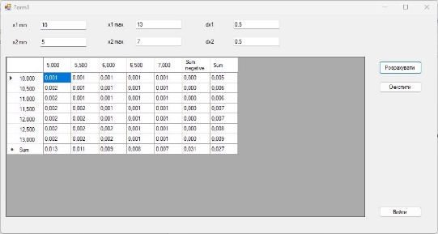

Лабораторна робота № 10   

**Відображення довільних даних у табличній формі за допомогою**  

**компонента DataGridView.**  

Мета. Ознайомлення принципами виведення масиву даних за допомогою класу DataGridView.   

**Теоретичні відомості**  

Компонент DataGridView дозволяє відобразити колекції складних даних, що можуть бути зчитані з файлів бази даних або розраховані за допомогою певних алгоритмів, у табличному виді. Застосування компонента DataGridView  розглянемо на прикладі.  

**Приклад.** Розробити застосунок Windows Forms, який розраховуватиме заданий математичний вираз з двома змінними *f(x1,x2)=x1+x2* в певному діапазоні для обох змінних. Програма повинна забезпечувати ввід мінімальних *x1min* , *x2min* та  максимальних  *x1max  ,  x2max*  значень,  а  також  кроку  зміни  *dx1,  dx2*.  Всі розраховані  значення  виразу  слід  вивести  у  вікно  в  табличній  формі  за допомогою елемента керування DataGridView.    

` `Порядок виконання завдання   

В середовищі Microsoft Visual Studio створити новий проект застосунку 

Windows Forms.   

Розробка головного вікна застосунку   

1. Змінити назву файла, який описує головне вікно, на fMain.   
1. Автоматично  створена  форма  представлятиме  головне  вікно 

програми. Привести форму до вигляду згідно рис. 10.1. Для цього розмістити на ній:   

- 6 компонентів Label   
- 6 компонентів Textbox   
- компонент DataGridView   
- 3 компоненти Button   
3. Задати  назви  (властивість  Name)  елементів  керування  TextBox 

відповідно до призначення:   

- tbx1min   
- tbx1max   
- tbdx1   
- tbx2min   
- tbx2max   
- tbdx2   
- Задати назву (властивість Name) елемента керування DataGridView:  
- gv   

*Рис. 10.1. Головна форма застосунку*   

5. Задати назви (властивість Name) елементів керування Button:   
- btnCalc (Розрахувати)   
- btnClear (Витерти)   
- btnExit (Вийти)   
6. Продумати алгоритм програми. Алгоритм для виконання завдання 

такий:   

1) Отримати  значення  x1min,  x1max,  dx1,  x2min,  x2max, 

dx2.   

2) Відповідно  до  введених  даних,  обчислити  кількість 

стовпчиків та рядків таблиці.   

3) У  циклі  пройти  по  всіх  комірках  стовпчика  із 

заголовками рядків та заповнити його значеннями змінної x1.   

4) У циклі пройти по всіх комірках рядка із заголовками 

стовпчиків та заповнити його значеннями змінної x2.   

5) rw = 0 (змінна rw представляє поточний індекс рядка).   
5) x1 = x1min (змінна x1 представляє поточне значення x1).   
5) У циклі, поки x1 <= x1max:   
- x2 = x2min (змінна x2 представляє поточне значення x2).   
- cl = 0 (змінна cl представляє поточний індекс стовпчика).   
- У циклі, поки x2 <= x2max:   

o Розрахувати значення функції для поточних значень x1 та x2 і вивести його у комірку.  o Збільшити x2 на dx2, збільшити cl на 1.   

- Збільшити x1 на dx1, збільшити rw на 1.   
7. У  оброблювач  події  Click  для  кнопки  btnCalc  ("Розрахувати") 

записати код з лістингу 10.1.   

|Лістинг 10.1 |
| - |
|
// Перетворення текстових рядків, які ввів користувач,    

// у змінні числового типу  double x1min = double.Parse(tbx1min.Text);  double x1max = double.Parse(tbx1max.Text);  double x2min = double.Parse(tbx2min.Text);   
|

double x2max = double.Parse(tbx2max.Text);  double dx1 = double.Parse(tbdx1.Text);  double dx2 = double.Parse(tbdx2.Text);   ![ref1]

// Обчислення кількості рядків та стовпчиків таблиці  gv.ColumnCount = (int)Math.Truncate((x2max - x2min) / dx2) + 1; gv.RowCount = (int)Math.Truncate((x1max - x1min) / dx1) + 1;    

// Вивід заголовків рядків та стовпців таблиці  

for (int i = 0; i < gv.RowCount; i++)   

`    `gv.Rows[i].HeaderCell.Value = (x1min + i \* dx1).ToString("0.000");               gv.RowHeadersWidth = 80;   

for (int i = 0; i < gv.ColumnCount; i++)   

{      gv.Columns[i].HeaderCell.Value = (x2min + i \* dx2).ToString("0.000");    

`              `gv.Columns[i].Width = 60;   

}   

// Для автоматичного підлаштування розмірів стовпчиків та рядків    // можна використовувати ці методи   

//gv.AutoResizeColumns();   

//gv.AutoResizeRows();   

int cl, rw;  

`         `double x1, x2, y;   

// Розрахунок і вивід езультатів   

`          `rw = 0; x1 = x1min;  while ![ref1]

(x1 <= x1max)   

{   

`    `x2 = x2min; cl = 0;      while (x2 <= x2max)   

`    `{   

`        `y = x1 + x2;   

`        `gv.Rows[rw].Cells[cl].Value = y.ToString("0.000");         

x2 += dx2;         cl++;   

`    `}     x1 

+= dx1;     rw++;   

}   

8. У оброблювач події Click для кнопки btnClear ("Очистити") записати 

наступний код з лістингу 10.2.   

|Лістинг 10.2 |
| - |
|
tbx1min.Text = ""; tbx1max.Text = ""; tbx2min.Text = ""; tbx2max.Text = ""; tbdx1.Text = ""; tbdx2.Text = "";   gv.Rows.Clear();   

for (int Cl = 0; Cl < gv.ColumnCount; Cl++)     gv.Columns[Cl].HeaderCell.Value = "";   
|

9. У оброблювач події Click для кнопки btnExit ("Вихід") записати код 

з лістингу 10.3.   

|Лістинг 10.3 |
| - |
|
if (MessageBox.Show("Закрити програму?", "Вихід з програми",        MessageBoxButtons.OKCancel, MessageBoxIcon.Question) ==   DialogResult.OK)   

`        `Application.Exit();   
|

10. Запустити застосунок (F5) і перевірити його функціонал. Приклад 

вікна програми з розрахунковими даними приведено на рис. 10.2.   

*Рис. 10.2. Приклад вікна програми з розрахунковими даними*   

Завдання для самостійного опрацювання   

1. Вирішити розглянуте раніше завдання для заданої функції *f(x1, x2)* згідно варіанту (30+№ за переліком).    
1. Додатково до попереднього завдання, обчислити та вивести на екран:   
- для варіантів, номери яких закінчуються на 0 чи 5 – суму всіх від'ємних розрахованих проміжних значень *f(x1, x2)*;   
- для варіантів, номери яких закінчуються на 1 чи 6 – добуток всіх додатних розрахованих проміжних значень *f(x1, x2)*;   
- для варіантів, номери яких закінчуються на 2 чи 7 – суму від'ємних синусів всіх розрахованих проміжних значень *f(x1, x2)*;   
  - для варіантів, номери яких закінчуються на 3 чи 8 – суму додатних косинусів всіх розрахованих проміжних значень *f(x1, x2)*;   
- для  варіантів,  номери  яких  закінчуються  на  4  чи  9  –  суму  квадратів  всіх від'ємних розрахованих проміжних значень *f(x1, x2)*;   

4\. В кінці до таблиці з результатами додати порожній рядок (знизу) та стовпчик (справа) і заповнити їх:   

- для парних варіантів – сумами відповідних стовпчиків та рядків;   
- для непарних варіантів – середніми значеннями відповідних стовпчиків та 

  рядків.   

В ході роботи було розроблено форму із GridView з використанням формули із таблиці(варіант 10). Було додано додаткові стовбці для підрахунку суми від’ємних значень та підрахунку суми всіх елементів певного рядка. Для цього в цикл, для додавання елементів було додано змінну, в яку додається кожний елемент. (в залежності від того підрахунок це в стовпці чи рядку це відбувається у різних циклах.) 

Код програми: 

using System; 

using System.Collections.Generic; using System.ComponentModel; using System.Data; 

using System.Drawing; 

using System.Linq; 

using System.Text; 

using System.Threading.Tasks; using System.Windows.Forms; 

namespace Lab10 

{ 

`    `public partial class Form1 : Form     { 

`        `public Form1() 

`        `{ 

`            `InitializeComponent(); 

`        `} 

`        `private void button3\_Click(object sender, EventArgs e)         { 

`            `Application.Exit(); 

`        `} 

`        `private void btnCalc\_Click(object sender, EventArgs e) 

`        `{ 

`            `// Перетворення текстових рядків, які ввів користувач,             // у змінні числового типу 

`            `double x1min = double.Parse(tbx1min.Text); 

`            `double x1max = double.Parse(tbx1max.Text); 

`            `double x2min = double.Parse(tbx2min.Text); 

`            `double x2max = double.Parse(tbx2max.Text); 

`            `double dx1 = double.Parse(tbdx1.Text); 

`            `double dx2 = double.Parse(tbdx2.Text); 

`            `// Обчислення кількості рядків та стовпчиків таблиці 

`            `gv.ColumnCount = (int)Math.Truncate((x2max - x2min) / dx2) + 3; 

`            `gv.RowCount = (int)Math.Truncate((x1max - x1min) / dx1) + 2;             // Вивід заголовків рядків та стовпців таблиці 

`            `for (int i = 0; i < gv.RowCount - 1; i++) 

`                `gv.Rows[i].HeaderCell.Value = (x1min + i \* dx1).ToString("0.000"); 

`            `gv.RowHeadersWidth = 80; 

`            `for (int i = 0; i < gv.ColumnCount - 1; i++) 

`            `{ 

`                `gv.Columns[i].HeaderCell.Value = (x2min + i \* dx2).ToString("0.000"); 

`                `gv.Columns[i].Width = 60; 

`            `} 

`            `gv.Columns[gv.ColumnCount - 2].HeaderCell.Value = "Sum negative"; 

`            `gv.Columns[gv.ColumnCount - 1].HeaderCell.Value = "Sum"; 

`            `gv.Rows[gv.RowCount - 1].HeaderCell.Value = "Sum"; 

`            `// Для автоматичного підлаштування розмірів стовпчиків та рядків 

`            `// можна використовувати ці методи 

`            `//gv.AutoResizeColumns(); 

`            `//gv.AutoResizeRows(); 

`            `int cl, rw; 

`            `double x1, x2, y; 

`            `// Розрахунок і вивід езультатів 

`            `double[] columnSums = new double[gv.ColumnCount - 2]; 

`            `Double sum = 0; 

`            `Double totalRowSum = 0; 

`            `rw = 0; x1 = x1min; 

`            `while (x1 <= x1max) 

`            `{ 

`                `x2 = x2min; cl = 0; 

`                `while (x2 <= x2max) 

`                `{ 

`                    `y = Math.Pow(Math.Sin((x1 \* (x2 / (x1 + 53 \* Math.Pow(x2, 2))))), 2); 

`                    `if (y< 0) 

`                    `{ 

`                        `sum += y; 

`                    `} 

`                    `columnSums[cl] += y; 

`                    `totalRowSum += y; 

`                    `gv.Rows[rw].Cells[cl].Value = y.ToString("0.000");                     x2 += dx2; cl++; 

`                `} 

`                `gv.Rows[rw].Cells[gv.ColumnCount - 2].Value = sum.ToString("0.000"); 

`                `gv.Rows[rw].Cells[gv.ColumnCount - 1].Value = totalRowSum.ToString("0.000"); 

`                `totalRowSum = 0; 

`                `sum = 0; 

`                `x1 += dx1; 

`                `rw++; 

`            `} 

for (int i = 0; i < gv.ColumnCount - 2; i++) { 

`                `gv.Rows[gv.RowCount - 1].Cells[i].Value = columnSums[i].ToString("0.000"); 

`            `} 

`        `} 

`    `} 

}

Результат роботи програми зображено на рисунку 10.1. 

Рисунок 10.1 – Модифікована програма з формулою по варіанту і 

додатковими стовпцями/рядком 

[ref1]: Aspose.Words.eb7af00a-5598-4d5e-9ea0-a6ed652575af.002.png
