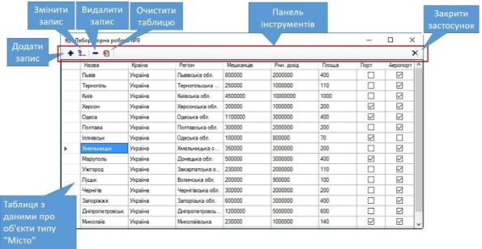
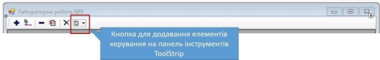
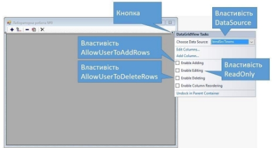
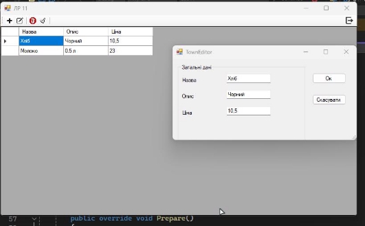
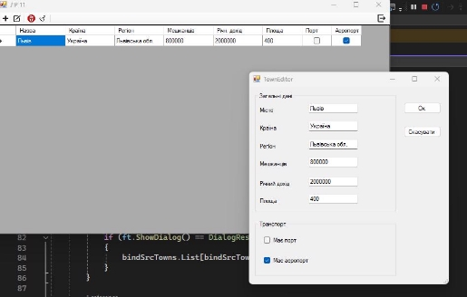

Лабораторна робота №11   

**Відображення даних про об'єкти одного класу в табличній формі.**  

Мета. Ознайомлення принципами виведення даних про множину об'єктів за допомогою класу DataGridView.   

` `**Теоретичні відомості** **Приклад**   

Розробити застосунок Windows Forms, який забезпечує внесення даних про об'єкти  типу  "місто"  та  відображення  цих  даних  у  табличній  формі  за допомогою  елемента  керування  DataGridView.  Крім  цього,  застосунок  має забезпечувати редагування даних про об'єкт типу "місто", видалення даних про  вибраний  об'єкт  та  загальне  очищення  списку.  Керування  роботою програми реалізувати через панель інструментів.   

Порядок виконання завдання   

В  середовищі  Microsoft  Visual  Studio  створити  новий  проект  застосунку Windows Forms.   

Проектування інтерфейсу застосунку   

Для виконання всіх перелічених задач слід спроектувати інтерфейс вікна. На рис. 11.1 приведено вигляд вікна, розробка якого буде описана далі. Дії, які виконуватиме програма:   

1) Додавання нового запису.   
1) Редагування вибраного запису.   
1) Видалення вибраного запису.   
1) Відображення списку записів у табличній формі.   
1) Очищення таблиці (видалення всіх записів).   
1) Вихід з програми.   

Для виклику всіх цих дій використаємо компонент ToolStrip.   

Розробка головного вікна   

1. Задати властивості головного вікна:   
- Name = fMain (змінити у Solution Explorer)   
- Text = "Лабораторна робота №10"   
- StartPosition = CenterScreen   

*Рис. 11.1. Головне вікно застосунку*   

2. На головній формі розмістити компонент ToolStrip.   
2. За  допомогою  спеціальної  кнопки  компонента  ToolStrip  розмістити  на панелі інструментів такі елементи керування (рис. 11.2, але спочатку вони будуть без піктограм):   
- кнопку (Button) – для додавання запису   
- кнопку (Button) – для зміни запису   
- розділювач (Separator)   
- кнопку (Button) – для видалення запису   
- кнопку (Button) – для очищення таблиці   
- розділювач (Separator)   
- кнопку (Button) – для виходу з програми   

*Рис. 11.2. Панель Toolstrip*   

4. Задати властивості кнопки для додавання нового запису:   
- Name = btnAdd   
- Text = "Додати запис про місто"   
- Image – задати піктограму, вибравши відповідний фал. Для цього натиснути на кнопку з трикрапкою біля цієї властивості у вікні  

  Properties   

5. Задати властивості кнопки для зміни поточного запису:   
- Name = btnEdit   
- Text = "Редагувати запис"   
- Image – задати піктограму, вибравши відповідний фал. Для цього натиснути на кнопку з трикрапкою біля цієї властивості у вікні  

  Properties   

6. Задати властивості кнопки для видалення поточного запису:   
- Name = btnDel   
- Text = "Видалити запис"   
- Image – задати піктограму, вибравши відповідний фал. Для цього натиснути на кнопку з трикрапкою біля цієї властивості у вікні  

  Properties   

7. Задати властивості кнопки для очищення таблиці:   
- Name = btnClear   
- Text = "Очистити дані"   
- Image – задати піктограму, вибравши відповідний фал. Для цього натиснути на кнопку з трикрапкою біля цієї властивості у вікні  

  Properties   

8. Задати властивості кнопки для виходу з програми:   
- Name = btnExit   
- Text = "Вийти з програми"   
- Image – задати піктограму, вибравши відповідний фал. Для цього натиснути на кнопку з трикрапкою біля цієї властивості у вікні  

  Properties   

9. Для розділювачів задати властивість:   
   1. Name = tsSeparator1 та tsSeparator2 відповідно   
9. Зручно, щоб кнопка "Вийти з програми" була не разом зі всіма іншими кнопками, а окрема, біля правого краю панелі інструментів. Тому потрібно збільшити відступ зліва для цієї кнопки (відступи задає властивість Margin кнопки). Для цього в оброблювач події Resize форми fMain записати код з лістингу 11.1.   

|Лістинг 11.1 |
| - |
|
private void fMain\_Resize(object sender, EventArgs e)   

{   

` `int buttonsSize = 5 \* btnAdd.Width + 2 \* tsSeparator1.Width + 30;      

btnExit.Margin = new Padding(Width - buttonsSize, 0, 0, 0); }   
|

11. Розмістити  на  формі  компонент  BindingSource.  Після  розміщення  він з'явиться  у  нижній  частині  дизайнера  форм.  Для  нього  слід  задати властивість:   
- Name = bindSrcTowns   
12. Розмістити  на  формі  компонент  DataGridView.  Він  призначений  для відображення  даних  про  об'єкти.  Для  компонента  DataGridView  задати властивості:   
- Name = gvTowns   
- DataSource = bindSrcTowns (цим вказуємо, що джерелом даних для таблиці буде раніше розміщений на формі bindSrcTowns)   
- Dock = Fill (вибрати з випадаючого списку)   
- AllowUserToAddRows = false   
- AllowUserToDeleteRows = false   
- ReadOnly = true   

Властивості DataSource, AllowUserToAddRows, AllowUserToDeleteRows та ReadOnly компонента DataGridView можна задати також у дизайнері форм. Для цього слід клікнути на маленькій кнопці зі стрілкою зверху справа компонента DataGridView (рис. 10.3).   

*Рис. 11.3. Налаштування компонента DataGridView у дизайнері форм*   

Створення класу, який описує об'єкт "місто"   

За завданням програма має працювати з об'єктами типу "місто". Такий об'єкт опишемо у класі Town. Щоб створити новий файл з описом класу:   

1. У  контекстному  меню  для  елемента,  який  відповідає  проекту  (у  вікні Solution Explorer), вибрати команду Add\New Item… У вікні, яке з'явиться, в переліку Visual C# Items вибрати пункт Class, ввести назву класу – Town, і натиснути кнопку Add.   
1. У файлі Town.cs (він відкриється у редакторі коду) ввести опис класу (його можна  скопіювати  з  лабораторної  №8  і  підредагувати).  Код  класу приведено  у  лістингу  11.2.  Від  прикладу,  наведеному  в  попередній лабораторній  роботі,  цей  код  відрізняється  тим,  що  замість  полів використано  властивості.  Справа  у  тому,  що  компонент  BindingSource працює з властивостями, а не полями. При цьому використано властивості з автоматичною реалізацією (методів доступу та підтримуючого поля не задано).   

|Лістинг 11.2 |
| - |
|
public class Town   

{   public string Name { get; set; }       public string Country { get; set; }       public string Region { get; set; }       public int Population { get; set; }       public double YearIncome { get; set; }       public double Square { get; set; }      public bool HasPort { get; set; }       public bool HasAirport { get; set; }   

` `public double GetYearIncomePerInhabitant()       {   

`        `return YearIncome / Population;   

`    `}    

`    `public Town()   

`    `{     

`    `}    

`    `public Town(string name, string country, string region,  int population,      double yearIncome, double square,  bool hasPort, bool hasAirport)     {   
|

Name = name;   

Country = country;   

Region = region;   

Population = population;   YearIncome = yearIncome;   Square = square;   

HasPort = hasPort;   

HasAirport = hasAirport;     }  }   

Конструктор без параметрів створює об'єкт, не ініціалізуючи його властивості, а другий конструктор створює об'єкт та присвоює його властивостям задані значення.   

3. Перед першим показом головного вікна (в оброблювачі події Load головної форми) ініціалізуємо BindingSource та DataGridView (лістинг 11.3).   

Лістинг 11.3  

gvTowns.AutoGenerateColumns = false;   

DataGridViewColumn column = new DataGridViewTextBoxColumn(); column.DataPropertyName = "Name";  column.Name = "Назва"; gvTowns.Columns.Add(column);   

column = new DataGridViewTextBoxColumn(); column.DataPropertyName = "Country";  column.Name 

- "Країна"; gvTowns.Columns.Add(column);   

column = new DataGridViewTextBoxColumn(); column.DataPropertyName = "Region";  column.Name 

- "Регіон"; gvTowns.Columns.Add(column);   

column = new DataGridViewTextBoxColumn(); column.DataPropertyName = "Population";  column.Name 

- "Мешканців";  

gvTowns.Columns.Add(column);   

column = new DataGridViewTextBoxColumn(); column.DataPropertyName = "YearIncome";  column.Name = "Річн. дохід";  gvTowns.Columns.Add(column);   

column = new 

DataGridViewTextBoxColumn(); column.DataPropertyName = "Square"; column.Name = "Площа";  column.Width = 80;   gvTowns.Columns.Add(column);   

column = new DataGridViewCheckBoxColumn();  column.DataPropertyName = "HasPort";  column.Name = "Порт";  column.Width = 60;   gvTowns.Columns.Add(column);   

column = new DataGridViewCheckBoxColumn(); column.DataPropertyName = "HasAirport";  column.Name = "Аеропорт";  column.Width = 60;   

gvTowns.Columns.Add(column);   

bindSrcTowns.Add(new Town("Львів", "Україна", "Львівська обл.", 800000,    2000000, 400, false, true));  

EventArgs args = new EventArgs();  

OnResize(args);  

4. Запустити програму (F5). На цьому етапі розробки у вікні має відобразитися таблиця з одним записом, який додається в оброблювачі події Load форми (рис. 11.4). Закрити застосунок.   

*Рис. 11.4. Вікно з одним записом, який додається при запуску програми*   

*Рис. 11.5. Вікно для введення даних про місто**  

Для внесення даних про місто при додаванні нового запису або при зміні існуючого  запису  використаємо  форму  fTown,  розроблену  протягом попередньої лабораторної роботи (рис. 11.5). Щоб використати розроблене раніше вікно, слід:   

1) З папки "старого" проекту слід скопіювати в папку Lab11\Lab11 нового проекту такі файли: fTown.cs, fTown.Designer.cs  та fTown.resx.   
1) З контекстного меню Solution Explorer, викликаного на пункті , який відповідає  проекту, вибрати  команду Add\Existing  Item…   
1) У вікні, що з'явиться, вибрати раніше скопійований файл fTown.cs, і натиснути кнопку Add. Додані елементи мають відобразитися в Solution Explorer.   
1) У файлах fTown.cs та fTown.Designer.cs змінити назву простора імен на той, який використовує даний проект: namespace Lab11 замість старого namespace Lab9.   
6. Створити оброблювач події Click для кнопки btnAdd ("Додати запис про місто") і записати код з лістингу 11.4.   

|Лістинг 11.4 |
| - |
|
private void btnAdd\_Click(object sender, EventArgs e)   {   

`    `Town town = new Town();   

`    `fTown ft = new fTown(ref town);   

`    `if (ft.ShowDialog() == DialogResult.OK)       {   

`        `bindSrcTowns.Add(town);   

`    `}   

}   
|

7. Створити оброблювач події Click для кнопки btnEdit ("Редагувати запис") і записати код з лістингу 11.5.   

Лістинг 11.5  

private void btnEdit\_Click(object sender, EventArgs e)  

{   

`    `Town town = (Town)bindSrcTowns.List[bindSrcTowns.Position];   

`    `fTown ft = new fTown(ref town);   

`    `if (ft.ShowDialog() == DialogResult.OK)   

`    `{   

`        `bindSrcTowns.List[bindSrcTowns.Position] = town;     }  }   

8. Створити оброблювач події Click для кнопки btnDel ("Видалити запис") і записати код з лістингу 11.6.   

|Лістинг 11.6 |
| - |
|
private void btnDel\_Click(object sender, EventArgs e)   

{      if (MessageBox.Show("Видалити поточний 

запис?",              

"Видалення запису", MessageBoxButtons.OKCancel,              MessageBoxIcon.Warning) == DialogResult.OK)   

`    `{   

`        `bindSrcTowns.RemoveCurrent();     }  }   
|

9. Створити оброблювач події Click для кнопки btnClear ("Очистити дані") і записати код з лістингу 11.7.   

Лістинг 11.7  

private void btnClear\_Click(object sender, EventArgs e)   {   

`    `if (MessageBox.Show(   

`        `"Очистити таблицю?\n\nВсі дані будуть втрачені",   

`        `"Очищення даних", MessageBoxButtons.OKCancel,           MessageBoxIcon.Question) == DialogResult.OK)   

`    `{   

`        `bindSrcTowns.Clear();       } }   

10. Створити оброблювач події Click для кнопки btnExit ("Вийти з програми") 

    і записати код з лістингу 11.8.    

Лістинг 11.8   

private void btnExit\_Click(object sender, EventArgs e)   

{   

`    `if (MessageBox.Show("Закрити застосунок?", "Вихід з програми",             MessageBoxButtons.OKCancel,    

`        `MessageBoxIcon.Question) == DialogResult.OK)   

`    `{   

`        `Application.Exit();      }}   

11. Запустити  застосунок  і  протестувати  його  роботу.  Слід  перевірити функціонал всіх кнопок панелі інструментів: додавання запису, його зміна, видалення, очищення таблиці, вихід з програми (див. рис. 11.6).   

*Рис. 11.6. Схема функціонування застосунку*   

**Завдання для самостійного опрацювання**  

Вирішити розглянуте раніше завдання щодо предметної області, вказаної у завданні до лабораторної роботи №4.   

Завдання було вирішено аналогічно до ходу роботи: були додані кнопки, а також предметна область – “Продукти”. 

Код головної форми програми: 

using System; 

using System.Collections.Generic; using System.ComponentModel; using System.Data; 

using System.Drawing; 

using System.Linq; 

using System.Text; 

using System.Threading.Tasks; using System.Windows.Forms; 

namespace Lab11 

{ 

`    `public partial class Form1 : Form     { 

`        `public Form1() 

`        `{ 

`            `InitializeComponent(); 

`        `} 

`        `private void Form1\_Load(object sender, EventArgs e) 

`        `{ 

`            `int buttonsSize = 5 \* btnAdd.Width + 2 \* tsSeparator1.Width + 30; 

`            `btnExit.Margin = new Padding(Width - buttonsSize, 0, 0, 0); 

gvTowns.AutoGenerateColumns = false; 

DataGridViewColumn column = new DataGridViewTextBoxColumn(); column.DataPropertyName = "Name"; 

column.Name = "Назва"; gvTowns.Columns.Add(column); 

column = new DataGridViewTextBoxColumn(); column.DataPropertyName = "Description"; 

column.Name = "Опис"; 

gvTowns.Columns.Add(column); 

column = new DataGridViewTextBoxColumn(); column.DataPropertyName = "Price"; 

column.Name = "Ціна"; 

gvTowns.Columns.Add(column); 

bindSrcTowns.Add(new Food("Хліб", "Чорний", 10.50)); EventArgs args = new EventArgs(); 

OnResize(args); 

} 

`        `private void btnAdd\_Click(object sender, EventArgs e)         { 

`            `Food food = new Food(); 

`            `TownEditor ft = new TownEditor(food); 

`            `if (ft.ShowDialog() == DialogResult.OK) 

`            `{ 

`                `bindSrcTowns.Add(food); 

`            `} 

`        `} 

`        `private void btnEdit\_Click(object sender, EventArgs e) 

`        `{ 

`            `Food food = (Food)bindSrcTowns.List[bindSrcTowns.Position];             TownEditor ft = new TownEditor(food); 

`            `if (ft.ShowDialog() == DialogResult.OK) 

`            `{ 

`                `bindSrcTowns.List[bindSrcTowns.Position] = food; 

`            `} 

`        `} 

`        `private void btnDel\_Click(object sender, EventArgs e)         { 

`            `if (MessageBox.Show("Видалити поточний запис?", "Видалення запису", MessageBoxButtons.OKCancel, MessageBoxIcon.Warning) == DialogResult.OK) 

`            `{ 

`                `bindSrcTowns.RemoveCurrent(); 

`            `} 

`        `} 

`        `private void btnClear\_Click(object sender, EventArgs e)         { 

`            `if (MessageBox.Show( 

"Очистити таблицю?\n\nВсі дані будуть втрачені", 

"Очищення даних", MessageBoxButtons.OKCancel, MessageBoxIcon.Question) == DialogResult.OK) 

`            `{ 

`                `bindSrcTowns.Clear(); 

`            `} 

`        `} 

`        `private void btnExit\_Click(object sender, EventArgs e)         { 

`            `if (MessageBox.Show("Закрити застосунок?", "Вихід з програми", 

MessageBoxButtons.OKCancel, 

MessageBoxIcon.Question) == DialogResult.OK) 

`            `{ 

`                `Application.Exit(); 

`            `} 

`        `} 

`    `} 

}

Код другої форми для редагування/додавання елементів: 

using System; 

using System.Collections.Generic; using System.Linq; 

using System.Text; 

using System.Threading.Tasks; 

namespace Lab11 

{ 

`    `public abstract class Product 

`    `{ 

`        `public abstract string Name { get; set; } 

`        `public abstract string Description { get; set; }         public abstract double Price { get; set; } 

public abstract void Use(); public abstract void Prepare(); 

} 

`    `public class Food : Product 

`    `{ 

`        `public override string Name { get; set; } 

`        `public override string Description { get; set; }         public override double Price { get; set; } 

`        `public Food(string name, string desr, double price)         { 

`            `Name = name; 

`            `Description = desr; 

`            `Price = price; 

`        `} 

`        `public Food() 

`        `{ 

} 

`        `public override void Use() 

`        `{ 

`            `Console.WriteLine($"Ви з'їли {Name}"); 

} 

`        `public override void Prepare() 

`        `{ 

`            `Console.WriteLine($"Ви приготували {Name}");         } 

`        `public virtual void MoveToTrashBin() 

`        `{ 

`            `Console.WriteLine($"Ви викинули {Name} у смітник");         } 

} 

`    `class Bread : Food 

`    `{ 

`        `public override void Prepare() 

`        `{ 

`            `Console.WriteLine("Ви зробили грінку і приготували бутерброд"); 

`        `} 

`        `public override void MoveToTrashBin() 

`        `{ 

`            `Console.WriteLine("Ви не можете викинути хліб. Хліб - усьому голова"); 

`        `} 

`    `} } 

Робота програми зображена на рисунку 11.1. 

Рисунок 11.1 – Програма для обліку продуктів Варіант виконання із ходу роботи зображено на рисунку 11.2 

Рисунок 11.2 – Облік міст 
