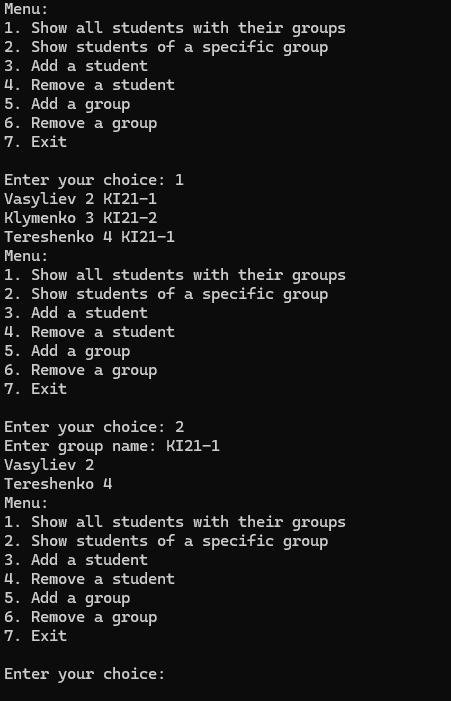

**Лабораторна робота № 2**  

**РОБОТА З МАСИВАМИ. ВИКОРИСТАННЯ МЕТОДІВ КЛАСУ**  

**ARRAY**   

**Мета роботи:** Набути умінь і навичок роботи з статичними і динамічними масивами мовою С# у середовищі Microsoft Visual Studio 2022.  

**Короткі теоретичні відомості**  

Масив задає спосіб організації даних. **Масивом*** називають упорядковану сукупність  елементів  одного  типу.  Кожен  елемент  масиву  має  індекси,  що визначають  порядок  елементів.  Число  індексів  характеризує  розмірність масиву. Кожен індекс змінюється в деякому діапазоні [a,b]. У мові C#, як й у багатьох інших мовах, індекси задаються цілочисельним типом. Діапазон [a,b] називається граничною парою, a – нижньою границею, b – верхньою границею  індексу. При оголошенні масиву границі задаються виразами. Якщо всі границі задані константними виразами, то число елементів масиву відомо в момент його оголошення і йому може бути виділена пам'ять ще на етапі трансляції. Такі масиви називаються статичними. Якщо ж вирази, що задають границі, залежать від змінних, то такі масиви називаються динамічними, оскільки пам'ять їм може бути відведена тільки динамічно в процесі виконання програми, коли стають відомими  значення  відповідних  змінних.  Масиву  виділяється  неперервна область  пам'яті.  В  C#  масиви  динамічні.  При  написанні  програм,  можна створювати одномірні, багатомірні масиви й масиви масивів.  

*Одномірні масиви*  

Оголошення одномірного масиву виглядає в такий спосіб:  

*<тип>[] <ім'я масиву>;*  

Квадратні  дужки  приписані  не  до  імені  змінної,  а  до  типу.  Вони  є невід’ємною  частиною визначення класу, так що, наприклад, запис *int []*** варто 

розуміти як клас одномірний масив з елементами типу *int*.  

Приклад оголошення трьох масивів з відкладеною ініціалізацією: int[] 

a, b, c;  

Найчастіше  при  оголошенні  масиву  використовується  ім'я  з ініціалізацією.  Як  і  у  випадку  простих  змінних,  можуть  бути  два  варіанти ініціалізації. У першому випадку ініціалізація є явною і задається константним масивом:  

double[] x= {5.5, 6.6, 7.7};  

У  другому  випадку  створення  й  ініціалізація  масиву  виконується  в об'єктному  стилі  з  викликом  конструктора  масиву.  І  це  найпоширеніша практика оголошення масивів:  

int[] d= new int[5];  

Розглянемо ще кілька прикладів оголошення масивів:  

...  

int[] k;   //k - масив  

k=new int [3];   //Визначаємо масив з 3-х цілих  

k[0]=-5; k[1]=4; k[2]=55;    //Задаємо елементи масиву  Console.WriteLine(k[2].ToString());    //Виводимо   третій елемент масиву  

...  

Зміст наведеного фрагмента ясний з коментарів. Зверніть увагу на деякі особливості.  По-перше,  масив  визначається  саме  як  *int[]  k*;  а  не  як  один  з 

наступних варіантів:  

int k[]; //Невірно! int k[3]; //Невірно! int[3] k; //Невірно!  

По-друге, оскільки масив представляє собою посилальний об'єкт, то для створення  масиву  необхідний  рядок  k=new  int  [3];*.*  Саме  в  ньому  ми  й визначаємо розмір масиву. Хоча, можливі конструкції виду* int[] k = new int [3];  

Елементи масиву можна задавати відразу при оголошенні. Наприклад: int[] k = {-5, 4, 55};.*  

В C# нумерація елементів масиву починається з нуля. Таким чином, у 

прикладі початковий елемент масиву – це k[0], а останній – k[2]. Елемента k[3] немає.  

*Динамічні масиви*  

У  всіх  вищенаведених  прикладах  оголошувалися  статичні  масиви, оскільки  нижня  границя  дорівнює  нулю  по  визначенню,  а  верхня  завжди задавалася в прикладах константою. В C# всі масиви, незалежно від того, яким виразом описується границя, розглядаються як динамічні. У дійсності реальні потреби в розмірі масиву, швидше за все, визначаються в процесі виконання програми.  

Синтаксично немає різниці в оголошенні статичних і динамічних масивів. Вирази, що задають границю зміни індексів, у динамічному випадку містять змінні. Єдина вимога – значення змінних повинні бути визначені в момент 

оголошення.   

Приклад, у якому описана робота з динамічним масивом:  public void TestDynAr() {  

//оголошення динамічного масиву A1  

Console.WriteLine("Введіть число елементів масиву 

A1"); int size = int.Parse(Console.ReadLine()); int[] A1 = 

new int[size]; }  

У даній процедурі верхня границя масиву визначається користувачем.  

*Багатомірні масиви*  

Поділ масивів на одномірні і багатомірні носить історичний характер. Ніякої принципової різниці між ними немає. Одномірні масиви – це окремий випадок багатомірних. Або: багатомірні масиви є природним узагальненням одномірних. Одномірні масиви дозволяють задавати такі математичні 

структури як вектори, двовимірні – матриці, тривимірні – куби даних, масиви більшої розмірності – багатомірні куби даних.  

Оголошення багатомірного масиву в загальному випадку:  

*<тип>[, ... ,] <ім'я\_масиву>;*  

Число ком, збільшене на одиницю, задає розмірність масиву. Хоча явна ініціалізація з використанням багатомірних константних масивів можлива, але застосовується рідко через громіздкість такої структури. Простіше ініціалізацію реалізувати програмно.  

Приклади:  

Двовимірний масив:  

int[,] k = new int [2,3];  

Тут пара квадратних дужок тільки одна. У нашому прикладі в масиві 6 

(=2\*3) елементів (k[0,0] – перший, k[1,2] – останній).  

Аналогічно можна задавати багатомірні масиви. Приклад тривимірного масиву:  

int[,,] k = new int [10,10,10];  

Варіант ініціалізації багатомірного масиву:  int[,] k = {{2,-2},{3,-22},{0,4}};  

*Масиви масивів*  

Ще одним видом масивів C# є масиви масивів, називані також порізаними масивами (jagged arrays). Такий масив масивів можна розглядати як одномірний масив, елементи якого є масивами, елементи яких, у свою чергу, знову можуть бути масивами, і так може тривати до деякого рівня вкладеності.  

Є деякі особливості в оголошенні й ініціалізації таких масивів. Якщо при оголошенні  типу  багатомірних  масивів  для  вказівки  розмірності використовувалися коми, то для порізаних масивів застосовується більш ясна символіка – сукупності пар квадратних дужок; наприклад, int [][]** задає масив, елементи якого – одномірні масиви елементів типу int. Складніше зі створенням самих масивів й їх ініціалізацією. Тут не можна викликати конструктор new int[3][5], оскільки він не задає порізаний масив. Фактично потрібно викликати конструктор для кожного масиву на самому нижньому рівні. У цьому й полягає складність оголошення таких масивів.  

Приклад:  

//масив масивів. Оголошення й ініціалізація  

int[][] jagger = new int[3][] { 

new int[] {5,7,9,11}, 

new int[] {2,8}, new 

int[] {6,12,4} 

;} 

Масив  jagger  має  всього  два  рівні.  Можна  вважати,  що  в  нього  три елементи, кожний з яких є масивом. Для кожного такого масиву необхідно викликати  конструктор  *new*,  щоб  створити  внутрішній  масив.  У  даному прикладі  елементи  внутрішніх  масивів  одержують  значення,  будучи  явно ініціалізовані  константними  масивами.  Звичайно,  припустиме  й  таке оголошення:  

int[][] jagger1 = new int[3][] { new 

int[4], new 

int[2], new 

int[3];} 

У  цьому  випадку  елементи  масиву  одержать  при  ініціалізації  нульові значення. Реальну ініціалізацію потрібно буде виконувати програмним шляхом. Варто  помітити,  що  в  конструкторі  верхнього  рівня  константу  3  можна опустити й писати просто *new int[][]***.** Виклик цього конструктора можна взагалі  опустити – він буде матися на увазі:  

int[][] jagger2 = { new 

int[4], new int[2], new int[3] 

}; 

Конструктори нижнього рівня необхідні. Ще одне важливе зауваження – динамічні масиви можливі й тут. У загальному випадку, границі на будь-якому рівні можуть бути виразами, що залежать від змінних. Більше того, припустимо, щоб масиви на нижньому рівні були багатовимірними.  

Приклади:  

//Оголошуємо 2-мірний східчастий масив  

int[][] k = new int [2][];  

//Оголошуємо 0-й елемент східчастого масиву.  // Це знову масив і у ньому 3 елементи k[0]=new int[3];  

//Оголошуємо 1-й елемент східчастого масиву.  // Це знову масив і у ньому 4 елементи k[1]=new int[4];  

k[1][3]=22; //записуємо 22 в останній елемент масиву  

...  

Зверніть  увагу,  що  в  східчастих  масивів  задається  декілька  пар  

квадратних  дужок (стільки, скільки розмірність у масиву).  

**Варіанти індивідуальних завдань**  

**Завдання 1**.  Задано одновимірний масив цілих чисел, в який необхідно записати інформацію про кількість виробів, вироблених кожним працівником бригади за день. Планове денне завдання для кожного працівника - 37 виробів.   Скласти  програму для обчислення величин, вказаних у варіантах завдань.  Значення масиву задати самостійно.  

**Варіанти завдань:**  

10\. Обчислити,  скільки  робітників  перевиконали  денне  завдання  не менше, ніж на 10%.  

Код програми: 

using System; 

using System.Collections.Generic; using System.Linq; 

using System.Text; 

using System.Threading.Tasks; 

namespace ConsoleApp2 

{ 

`    `internal class Program     { 

static void Main(string[] args) { 

Random random = new Random(); 

`            `int[] daily\_production = new int[10]; 

`            `for (int i = 0; i < daily\_production.Length; i++)             { 

`                `daily\_production[i] = random.Next(50); 

`                `Console.Write(daily\_production[i] + " "); 

`            `} 

`            `int counter = 0; 

`            `double norm = 37 + (37 \* 0.1); 

`            `for (int i = 0; i < daily\_production.Length; i++)             { 

`                `if (daily\_production[i] > norm) 

`                `{ 

`                    `counter++; 

`                `} 

`            `} 

`            `Console.WriteLine($"Перевиконали норму стiльки робiтникiв {counter}"); 

`            `Console.ReadLine(); 

`        `}     } 

}

Рисунок 2.1 – Результат знаходження кількості робітників з перевищеним виробітком 

**Завдання** **2**. Задано матрицю дійсних чисел (елементи матриці задати самостійно). Скласти програму для обчислення  величин, вказаних у варіантах завдань.  

**Варіанти завдань**:  

10\.Знайти найбільший елемент матриці і номери рядка та стовпця ,де він розташований  

Код програми: 

using System; 

using System.Collections.Generic; using System.Linq; 

using System.Text; 

using System.Threading.Tasks; 

namespace ConsoleApp1 

{ 

`    `class Program 

`    `{ 

`        `static void Main(string[] args) 

`        `{ 

`            `Random random = new Random(); 

`            `int[,] matrix = new int[5, 5]; 

`            `for (int i = 0; i < matrix.GetLength(0); i++) 

`            `{ 

`                `for(int j = 0; j < matrix.GetLength(1); j++)                 { 

`                    `matrix[i, j] = random.Next(50); 

`                `} 

`            `} 

`            `for (int i = 0; i < matrix.GetLength(0); i++) 

`            `{ 

`                `for (int j = 0; j < matrix.GetLength(1); j++)                 { 

`                    `Console.Write(matrix[i, j] + " "); 

`                `} 

`                `Console.WriteLine(); 

`            `} 

int max = matrix[0, 0]; int max\_x = 0; 

int max\_y = 0; 

`            `for (int i = 0; i < matrix.GetLength(0); i++) 

`            `{ 

`                `for (int j = 0; j < matrix.GetLength(1); j++)                 { 

`                    `if(matrix[i,j]> max) 

`                    `{ 

`                        `max = matrix[i, j]; 

`                        `max\_y = i; 

`                        `max\_x = j; 

`                    `} 

`                `} 

`            `} 

`            `Console.WriteLine($"X: {max\_x + 1} Y: {max\_y + 1}");             Console.ReadLine(); 

`        `} 

} 

Рисунок 2.2 – Результат знаходження координат найбільшого елемента матриці 

**Завдання 3 (загальне).**  

Створіть додаток, який здійснює операції над матрицями:  

- Множення матриці на число;   
- Додавання матриць;  ■ 

Добуток матриць.  

**Завдання 4 (загальне)**  

Створіть два динамічні масиви. Один містить перелік груп студентів у вигляді «НомерГрупи, НазватреаГрупи», інший масив містить перелік студентів у вигляді   «НомерСтудента,   ПІБ,  НомерГрупи».   Створіть 

систему   для редагування списку груп та списку студентів: виведення списку студентів з назвою відповідних груп, виведення студентів конкретної групи по її назві, додавання, та  видалення інформації по студентах та групах. Система повинна містити меню.  

Код програми: 

using System; 

using System.Collections.Generic; 

class Program 

{ 

`    `static List<object> group\_list = new List<object>();     static List<object> students = new List<object>(); 

`    `static void Main(string[] args)     { 

`        `InitializeGroups(); 

`        `InitializeStudents(); 

`        `bool exit = false; 

`        `while (!exit) 

`        `{ 

`            `Console.WriteLine("Menu:"); 

`            `Console.WriteLine("1. Show all students with their groups");             Console.WriteLine("2. Show students of a specific group");             Console.WriteLine("3. Add a student"); 

`            `Console.WriteLine("4. Remove a student"); 

`            `Console.WriteLine("5. Add a group"); 

`            `Console.WriteLine("6. Remove a group"); 

`            `Console.WriteLine("7. Exit"); 

Console.Write("\nEnter your choice: "); int choice = int.Parse(Console.ReadLine()); 

`            `switch (choice) 

`            `{ 

`                `case 1: 

`                    `ShowAllStudentsWithGroups();                     break; 

`                `case 2: 

`                    `ShowStudentsOfSpecificGroup();                     break; 

`                `case 3: 

`                    `AddStudent(); 

`                    `break; 

`                `case 4: 

`                    `RemoveStudent(); 

`                    `break; 

`                `case 5: 

`                    `AddGroup(); 

`                    `break; 

`                `case 6: 

`                    `RemoveGroup(); 

`                    `break; 

`                `case 7: 

`                    `exit = true; 

`                    `break; 

`                `default: 

`                    `Console.WriteLine("Invalid choice. Please try again."); 

`                    `break; 

`            `} 

`        `} 

`    `} 

`    `static void InitializeGroups() 

`    `{ 

`        `group\_list.Add(new List<object> { "KI21-1", 1 });         group\_list.Add(new List<object> { "KI21-2", 2 });         group\_list.Add(new List<object> { "KI21-3", 3 });         group\_list.Add(new List<object> { "KI21-4", 4 });         group\_list.Add(new List<object> { "KI21-5", 5 });     } 

`    `static void InitializeStudents() 

`    `{ 

`        `students.Add(new List<object> { 2, 1, "Vasyliev" });         students.Add(new List<object> { 3, 2, "Klymenko" });         students.Add(new List<object> { 4, 1, "Tereshenko" });     } 

`    `static void ShowAllStudentsWithGroups() 

`    `{ 

`        `foreach (List<object> studentData in students)         { 

`            `int student\_num = (int)studentData[0]; 

`            `int group\_num = (int)studentData[1]; 

`            `string surname = (string)studentData[2]; 

string groupName = GetGroupNameByNumber(group\_num); 

`            `Console.WriteLine($"{surname} {student\_num} {groupName}");         } 

`    `} 

`    `static void ShowStudentsOfSpecificGroup()     { 

`        `Console.Write("Enter group name: ");         string groupName = Console.ReadLine(); 

`        `foreach (List<object> studentData in students)         { 

`            `int student\_num = (int)studentData[0]; 

`            `int group\_num = (int)studentData[1]; 

`            `string surname = (string)studentData[2]; 

string group = GetGroupNameByNumber(group\_num); 

`            `if (group.Equals(groupName, StringComparison.OrdinalIgnoreCase)) 

`            `{ 

`                `Console.WriteLine($"{surname} {student\_num}"); 

`            `}         } 

`    `} 

`    `static void AddStudent() 

`    `{ 

`        `Console.Write("Enter student number: "); 

`        `int studentNumber = int.Parse(Console.ReadLine()); 

Console.Write("Enter group number: "); 

int groupNumber = int.Parse(Console.ReadLine()); 

Console.Write("Enter student surname: "); string surname = Console.ReadLine(); 

`        `students.Add(new List<object> { studentNumber, groupNumber, surname }); 

`        `Console.WriteLine("Student added successfully."); 

`    `} 

`    `static void RemoveStudent() 

`    `{ 

`        `Console.Write("Enter student surname to remove: ");         string surname = Console.ReadLine(); 

`        `for (int i = 0; i < students.Count; i++) 

`        `{ 

`            `List<object> studentData = (List<object>)students[i];             string studentSurname = (string)studentData[2]; 

`            `if (studentSurname.Equals(surname, StringComparison.OrdinalIgnoreCase)) 

`            `{ 

`                `students.RemoveAt(i); 

`                `Console.WriteLine("Student removed successfully.");                 return; 

`            `} 

`        `} 

`        `Console.WriteLine("Student not found.");     } 

`    `static void AddGroup() 

`    `{ 

`        `Console.Write("Enter group name: ");         string groupName = Console.ReadLine(); 

Console.Write("Enter group number: "); 

int groupNumber = int.Parse(Console.ReadLine()); 

`        `group\_list.Add(new List<object> { groupName, groupNumber });         Console.WriteLine("Group added successfully."); 

`    `} 

`    `static void RemoveGroup() 

`    `{ 

`        `Console.Write("Enter group name to remove: "); 

string groupName = Console.ReadLine(); 

`        `for (int i = 0; i < group\_list.Count; i++) 

`        `{ 

`            `List<object> groupData = (List<object>)group\_list[i];             string group = (string)groupData[0]; 

`            `if (group.Equals(groupName)) 

`            `{ 

`                `group\_list.RemoveAt(i); 

`                `Console.WriteLine("Group removed successfully.");                 return; 

`            `} 

`        `} 

`        `Console.WriteLine("Group not found.");     } 

`    `static string GetGroupNameByNumber(int groupNumber)     { 

`        `foreach (List<object> groupData in group\_list)         { 

`            `int num = (int)groupData[1]; 

`            `if (num == groupNumber) 

`            `{ 

`                `return (string)groupData[0]; 

`            `} 

`        `} 

`        `return "Unknown"; 

`    `} 

}

Результат роботи програми: 

Рисунок 2.3 – Робота програми для менеджменту студентів університету **Контрольні запитання**  

1. Дайте визначення масиву**.** Масив - це структура даних, що складається з однакових типів даних, які зберігаються у впорядкованому списку зі змінною довжиною. 
2. Як оголошуються одновимірні масиви? Одновимірні масиви оголошуються так: тип\_даних[] ім'я\_масиву; або тип\_даних ім'я\_масиву[]; 
2. В чому полягає різниця між статичними та динамічними масивами? Основна різниця полягає в тому, що розмір статичного масиву визначається при його оголошенні і залишається постійним, тоді як розмір динамічного масиву може змінюватися протягом виконання програми. 
2. Яким чином описуються багатовимірні масиви? Багатовимірні масиви описуються як тип\_даних[,] ім'я\_масиву; для двовимірних масивів, або в більш загальному випадку тип\_даних[,,] ім'я\_масиву; для масивів з більшою кількістю вимірів. 
2. Для чого використовують масиви масивів? Масиви масивів використовуються для створення структур даних з різними розмірами вкладених масивів або для створення "регулярних" масивів, де кожен рядок має однакову довжину. 
2. Опишіть синтаксис циклу foreach. Синтаксис циклу foreach: foreach (var елемент in колекція) { // код для обробки елемента } 
2. Загальний синтаксис методу Format. Синтаксис методу Format: string.Format("шаблон\_формату", аргумент1, аргумент2, ...); 
2. Назвіть основні методи класу System.Array та дайте їх коротку характеристику. Основні методи класу System.Array включають: Clear(), Copy(), IndexOf(), Reverse(), Sort(). Clear() очищає вміст масиву; Copy() копіює елементи масиву; IndexOf() повертає індекс першого входження елемента; Reverse() реверсує порядок елементів у масиві; Sort() сортує елементи масиву. 
