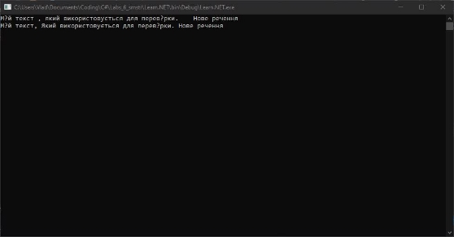

**Лабораторна робота № 7**  

**ОСНОВИ РОБОТИ З ФАЙЛАМИ В C#**  

**Мета роботи:** ознайомитися з основними правилами роботи з файлами та каталогами в C#.   

**Короткі теоретичні відомості**  

Робота з файлами в мові C# реалізується за допомогою потоків. Потік - це абстрактне поняття, яке описує будь-яке перенесення даних від джерела до приймача. Саме потоки дозволяють зчитувати дані з файлу і записувати дані в файл. Потік являє собою послідовність байтів і не залежить від конкретного пристрою,  з  яким  проводиться  обмін  (оперативна  пам'ять,  файл  на  диску, клавіатура, принтер).  

Для підтримки потоків бібліотека .NET містить ієрархію класів.  

Відзначимо, що ці класи визначені в просторі імен System.IO, Тому щоб скористатися об'єктами і методами цих класів, необхідно вказати простір імен System.IO в області директиви using на початку програми.  

Розглянемо деякі з перерахованих вище класів, необхідні для організації 

роботи з фалами, докладніше.  

*Класи TextReader и StreamReader*  

У мові C# Такі операції як зчитування даних з файлу і запис даних в файл реалізовані на основі маніпуляцій з байтами. Однак у зв'язку з тим, що людині набагато  зручніше  сприймати  інформацію,  представлену  в  символьному форматі, в бібліотеці .NET розроблені класи StreamReader и StreamWriter, Які 

дозволяють перетворювати байтові потоки в символьні і навпаки.  

Клас StreamReader є нащадком абстрактного базового класу TextReader, який  надає  класам-спадкоємцям  набір  методів,  що  реалізують  зчитування послідовності символів або рядків з потоку (файла).   

Для того, щоб отримати доступ до будь-якого з методів роботи з файлами, необхідно створити екземпляр класу StreamReader за допомогою конструктора StreamReader  (<им’я  файла>),  при  цьому  створюється  екземпляр  класу StreamReader і пов'язується з конкретним фізичним файлом. Як параметр можна вказати або тільки ім'я файлу і в цьому випадку файл повинен знаходитися в папці "... \bin\debug" поточного проекту, або повністю шлях і ім'я файлу.   

Приклад використання: try 

{ 

`    `StreamReader InputFile = new StreamReader("input.txt"); 

`    `while (InputFile.Peek()! = -1) 

`        `Console.Write((char)InputFile.Read()); 

`    `InputFile.Close(); 

} catch 

{ 

`    `Console.WriteLine("Не можу прочитати файл"); } 

Тут створено екземпляр класу StreamReader і пов'язано його з файлом "input.txt". Далі в циклі while зчитуємо посимвольний дані з файлу за допомогою методу Read() і виводимо їх на екран. Важливо те, що метод Read() повертає значення  певного  символу  в  форматі  int,  Тому  ми  перетворимо  його  в символьний  формат.  Після  того  як  кінець  файлу  досягнутий,  необхідно звільнити  ресурси  пам'яті,  виділені  потоку,  за  допомогою  методу  Close() оператор try дозволяє обробити помилку, яка може виникнути при роботі з файлом, наприклад, в разі якщо файл не знайдений.  

Для того, щоб перевірити працездатність програми, необхідно створити текстовий  файл  "input.txt"  і  зберегти  його  в  папці  "...\bin\debug"  поточного проекту. Це можна зробити в будь-якому текстовому редакторі, але зручніше - безпосередньо в середовищі Visual Studio. Для цього потрібно вибрати пункт меню File - New - File..., в діалоговому вікні створення нового файлу вибрати тип "Text File", а далі ввести в файл дані і зберегти його.  

Відзначимо,   що   альтернативою   методу   Close()   може 

служити використання конструкції *using.* В цьому випадку пам'ять, що займає поток, звільняється автоматично при виході з конструкції.   

Приклад:  

try { 

`    `using (StreamReader InputFile = new     StreamReader(@"c:\work\input.txt"))         

while (InputFile.Peek()! = -1) 

`            `Console.WriteLine(InputFile.ReadLine()); } 

catch { 

`    `Console.WriteLine("Не можу прочитати файл"); } 

Тут ми зчитуємо дані з файлу через покажчик і виводимо їх на екран. Зверніть увагу, що шлях до файлу вказано повністю, при цьому символ '@' дозволяє блокувати керуючі символи.  

Окремо розглянемо як приклад заповнення одновимірного і двовимірного масивів з файлу.  

В процесі заповнення одновимірного масиву з файлу слід враховувати таку  особливість:  фактична  розмірність  масиву,  тобто  кількість  елементів масиву, записаних в файл, заздалегідь невідома. Звідси при ініціалізації масиву ми  вказуємо  гранично  допустиму  розмірність  масиву  MaxArraySize,  А фактичну розмірність ArraySize визначаємо в процесі читання з файлу. Всі інші операції  з  масивом,  такі  як  вивід  або  перегляд  елементів  масиву,  потрібно виконувати, враховуючи не максимально допустиму, а фактичну розмірність масиву.  

Отже,  опишемо  метод  ReadFromFile(),  який  реалізує  заповнення цілочисельного одновимірного масиву MyArray із заданого файлу. Виходячи з умови задачі, в якості параметрів даного методу введемо, по-перше, ім'я файлу 

FileName,  по-друге,  одновимірний  масив  MyArray,  і,  нарешті,  фактичну розмірність масиву ArraySize, яка визначається в тілі методу.  

static void ReadFromFile(string FileName, int[] Arr, ref int ArrSize) 

{ 

`    `try 

`    `{ 

`        `using (StreamReader InputFile = new StreamReader(@FileName))         { 

`            `ArrSize = 0; 

`            `while (InputFile.Peek()! = -1) 

`            `{ 

`                `Arr[ArrSize] =                 

int.Parse(InputFile.ReadLine());                 ArrSize++; 

`            `}  }   }     

catch 

`    `{ 

`        `Console.WriteLine("Не можу прочитати файл");     } 

} 

В основній програмі необхідно описати і ініціалізувати одновимірний масив з урахуванням максимально допустимої розмірності масиву  MaxArraySize і викликати описаний вище метод ReadFromFile().  

static void Main() 

{     const int MaxArraySize = 1000;     int[] 

MyArray = new int[MaxArraySize];     int 

ArraySize = 0; 

`    `ReadFromFile("input.txt", MyArray, ref ArraySize); } 

Перш  ніж  запустити  програму,  необхідно  створити  текстовий  файл "input.txt", заповнити його цілими числами і зберегти в папці  "...\bin\debug" поточного  проекту.  Важливо  відзначити,  що  в  програмі  використовується порядкове зчитування даних за допомогою методу  

ReadLine(), Тому дані у вхідному файлі повинні бути введені не в одну строчку, а в стовпчик.  

static void Main() 

{     const int MaxArraySize = 1000;     int[] 

MyArray = new int[MaxArraySize];     int 

ArraySize = 0; 

`    `ReadFromFile("input.txt", MyArray, ref ArraySize); } 

При виконанні цього програмного коду ми вказуємо максимальний розмір масиву  MaxArraySize,  але  це  має  два  недоліки.  По-перше,  якщо  вказати максимальний  розмір  менше,  ніж  реальна  кількість  елементів  у  файлі,  то станеться  помилка.  По-друге,  якщо  вказувати  занадто  велике  значення MaxArraySize,  то  буде  виділятися  місце  в  пам'яті  під  елементи  масиву,  які ніколи не будуть використовуватися.  

З цієї ситуації є такий вихід: спочатку прочитати файл і дізнатися, скільки дійсно елементів він містить, а вже потім виділяти місце в пам'яті під елементи масиву. Метод Main() в такому випадку містить оператори:  

int[] MyArray; 

ReadFromFile("input.txt", out MyArray); метод 

ReadFromFile() Змінюється так:  

static void ReadFromFile(string FileName, out int[] MyArray) 

{ 

`    `try     {         int ArraySize = 0;         using (StreamReader InputFile = new StreamReader(@FileName)) 

`        `{// Підрахунок кількості елементів у файлі             while (InputFile.Peek()! = -1) 

`            `{ 

`                `InputFile.ReadLine(); 

`                `ArraySize++; 

`            `} 

`        `} 

`        `// Виділення пам'яті під необхідну кількість елементів         MyArray = new int[ArraySize];         using (StreamReader InputFile = new StreamReader(@FileName)) 

`        `{// Ініціалізація масиву             

for (int i = 0; i <= "" p = "" > 

`            `MyArray[i] = int.Parse(InputFile.ReadLine()); 

`        `}     

}     

catch 

`    `{ 

`        `Console.WriteLine("Не можу прочитати файл");         MyArray = null; 

`    `} 

} 

Важливо, що масив передається як вихідний параметр з використанням ключового слова out. Оскільки немає гарантії, що оператори в контрольованому блоці try виконуватимуться без помилок, блок catch повинен містити оператор обнулення вихідного параметру - масиву (ми присвоюємо значення null).  

*Класи FileInfo и DirectoryInfo*  

Методи  роботи  з  файлами  не  обмежуються  тільки  маніпуляціями  з даними в процесі введення / виведення, а включають в себе також такі операції як  копіювання,  переміщення,  видалення,  виведення  інформації  про  об'єкт файлової системи - файлі або каталозі. Для реалізації цих операцій в мові C# передбачені наступні класи:  

- Статичний  клас  Directory  і  клас  DirectoryInfo  дозволяють 

створювати, копіювати, переміщати, перейменовувати і видаляти каталоги, а також  отримувати  та  здавати  відомості  про  тип  DateTime,  пов'язані  зі створенням, доступу і записи каталогу;  

- Статичний  клас  File  і  клас  FileInfo  дозволяють  створювати, 

копіювати,  видаляти,  переміщати  і  відкривати  файли,  а  також  може використовуватися при ініціалізації об'єктів FileStream.  

Приклад:  видалити  всі  файли  з  заданим  розширенням  із  заданого каталогу, включаючи підкаталоги.  

Введемо  змінні  DirName  для  зберігання  імені  заданого  користувачем каталогу і FileName для зберігання імені файлу, введемо їх з клавіатури.  

Console.WriteLine("Введіть ім'я каталогу"); string DirName = Console.ReadLine(); 

Console.WriteLine("Введіть розширення файлів, які треба видалити"); string FileName = Console.ReadLine(); 

Далі опишемо метод DeleteFiles() наступним чином:  

static void DeleteFiles(string DirName, string FileName) { 

`    `try     

{         

Direct

oryInf

o 

MyDir = new Direct

oryInf

o(@Di

rName

);         

if 

(!MyD

ir.Exis

ts) // 

переві

рка 

існува

ння 

катало

гу 

`        `{ 

`            `Console.WriteLine("Каталог" + MyDir.Name + 

" не існує");             

return; 

`        `} 

`        `DelFiles(MyDir, FileName); 

`        `Console.WriteLine("Видалення завершено");     }     

catch 

`    `{ 

`        `Console.WriteLine("Помилка");     } 

} 

Тут ми ініціалізуємо екземпляр класу DirectoryInfo і пов'язуємо його з заданим  користувачем  каталогом.  У  разі  якщо  заданий  каталог  не  існує, виводимо  відповідне  повідомлення  на  екран.  Якщо  ж  такий  каталог  існує, викликаємо рекурсивний метод DelFiles(), який реалізує видалення файлів.  

static void DelFiles(DirectoryInfo MyDir, string FileName) {     // Вивід повного імені поточного каталогу на екран 

`    `Console.WriteLine(MyDir.FullName); 

`    `// Видалення всіх файлів із заданим ім'ям     FileInfo[] files = MyDir.GetFiles(FileName);     foreach (FileInfo f in files) f.Delete(); 

`    `// Перегляд всіх вкладених в поточний каталог підкаталогів     DirectoryInfo[] SubDirs = MyDir.GetDirectories();     foreach (DirectoryInfo d in SubDirs) DelFiles(d, FileName); } 

Тут пошук файлів, що задовольняють деякій умові пошуку, наприклад по заданому  розширенню,  здійснюється  за  допомогою  методу  GetFiles(), визначеного  в  класі  DirectoryInfo.  Так,  наприклад,  для  пошуку  будь-яких текстових файлів необхідно задати в якості умови пошуку рядок "\*.txt".  

Для отримання всіх каталогів, вкладених в поточний, використовується метод  GetDirectories().  Далі  для  кожного  з  знайдених  підкаталогів  процес пошуку і видалення файлів повторюється за рахунок рекурсивного виклику вихідного методу.  

**Завдання для лабораторної роботи**  

**Завдання  1.**  Кожне  з  цих  завдань  вирішите  з  використанням  класів 

StreamReader и StreamWriter. Реалізуйте в консольному додатку.  

1. У  вхідному  файлі  input.txt  в  стовпець  записані  цілі  числа.  У  файл 

output.txt переписати вихідні дані, а в останній рядок - їх середнє арифметичне. 

2. У вхідному файлі input.txt в стовпець записані цілі числа. У файл output.txt переписати вихідні дані, а в останній рядок - найбільше із значень, якщо їх декілька, то також вказати кількість таких елементів.  

   3. У вхідному файлі input.txt в стовпець записані цілі числа. У файл 

out1.txt записати всі парні числа, а в файл out2.txt - всі непарні.  

4. Дан текстовий файл input.txt. Вставити в початок кожного рядка її 

номер і записати перетворені рядки в файл output.txt.  

5. У вхідному файлі input.txt міститься довільну кількість рядків, в 

кожній з яких записана деяка послідовність цілих чисел, розділених пропуском. У файл output.txt вивести наступні дані про фото input.txt: кількість рядків і кількість елементів в кожному рядку.  

6. У вхідному файлі input.txt міститься довільну кількість рядків, в 

кожній з яких записана деяка послідовність цілих чисел, розділених пропуском. У файл output.txt вивести максимальний елемент в кожному рядку.  

7. У  вхідному  файлі  input.txt  міститься  текст,  записаний  малими 

англійськими  літерами.  У  файл  output.txt  вивести  цей  же  текст,  записаний великими літерами.  

8. У вхідному файлі input.txt міститься текст. У файл output.txt вивести 

відредагований текст, в якому видалені зайві пропуски між словами.  

9. У вхідному файлі input.txt міститься текст. У файл output.txt вивести 

в алфавітному порядку всі букви, що зустрічаються в тексті і їх кількість.  

10. У вхідному файлі input.txt міститься текст. У файл output.txt вивести 

відредагований  текст,  в  якому  видалені  всі  прогалини  перед  розділовими знаками (крім тире), а після розділового знака варто тільки один пробіл. Перше слово в реченні повинно починатися з великої літери.  

11. У вхідному файлі input.txt міститься текст. У файл output.txt вивести 

текст в зашифрованому вигляді: кожна літера вихідного тексту замінюється на наступну за нею в алфавіті (буква 'z' замінюється на 'а').  

12. У вхідному файлі input.txt міститься довільну кількість рядків, в 

кожній з яких записана деяка послідовність цілих чисел, розділених пропуском. У файл output.txt вивести наступні дані про фото input.txt: кількість рядків і кількість елементів в кожному рядку.  

13. У вхідному файлі input.txt міститься довільну кількість рядків, в 

кожній з яких записана деяка послідовність цілих чисел, розділених пропуском.  

У файл output.txt вивести максимальний елемент в кожному рядку.  

14. У  вхідному  файлі  input.txt  міститься  текст,  записаний  малими 

англійськими  літерами.  У  файл  output.txt  вивести  цей  же  текст,  записаний великими літерами.  

15. У вхідному файлі input.txt міститься текст. У файл output.txt вивести 

відредагований текст, в якому видалені зайві пропуски між словами.  

16. У вхідному файлі input.txt міститься текст. У файл output.txt вивести 

відредагований текст, в якому видалені зайві пропуски між словами.  

17. У вхідному файлі input.txt міститься текст. У файл output.txt вивести 

в алфавітному порядку всі букви, що зустрічаються в тексті і їх кількість.  

18. У вхідному файлі input.txt міститься текст. У файл output.txt вивести 

відредагований  текст,  в  якому  видалені  всі  прогалини  перед  розділовими знаками (крім тире), а після розділового знака варто тільки один пробіл. Перше слово в реченні повинно починатися з великої літери.  

19. У вхідному файлі input.txt міститься текст. У файл output.txt вивести 

текст в зашифрованому вигляді: кожна літера вихідного тексту замінюється на наступну за нею в алфавіті (буква 'z' замінюється на 'а').  

20. У вхідному файлі input.txt міститься довільну кількість рядків, в 

кожній з яких записана деяка послідовність цілих чисел, розділених пропуском. У файл output.txt вивести наступні дані про фото input.txt: кількість рядків і кількість елементів в кожному рядку.  

**Варіант 10.** У вхідному файлі input.txt міститься текст. У файл output.txt вивести  відредагований  текст,  в  якому  видалені  всі  прогалини  перед розділовими знаками (крім тире), а після розділового знака варто тільки один пробіл. Перше слово в реченні повинно починатися з великої літери.  

Для реалізації завдання були використані маркери логічного типу spacePending і newSentence, що означають очікування пробілу, для видалення зайвих і для позначення  нового  речення,  щоб  наступний  символ  зробити  великим.  Код програми: 

using System; using System.IO; 

namespace Learn.NET 

{ 

`    `class Program 

`    `{ 

`        `public static void Main(string[] args)         { 

`            `string fileText = ReadFile(); 

`            `string outputText = ""; 

`            `Console.WriteLine(fileText); 

`            `bool newSentence = true; 

`            `bool spacePending = false; 

`            `foreach (char symbol in fileText) 

`            `{ 

`                `string symbol\_new = symbol.ToString(); 

`                `if (char.IsWhiteSpace(symbol)) 

`                `{ 

`                    `spacePending = true; 

`                    `continue; 

`                `} 

`                `else if (symbol == ',' || symbol == '?' || symbol == '!' || symbol == '.') 

`                `{ 

`                    `spacePending = false; 

`                    `newSentence = true; 

`                `} 

`                `else if (newSentence) 

`                `{ 

`                    `if (char.IsWhiteSpace(symbol)) 

`                    `{ 

`                        `continue; 

`                    `} 

`                    `else 

`                    `{ 

`                        `if (spacePending && symbol != '-') 

`                        `{ 

`                            `outputText += " "; 

`                            `spacePending = false; 

`                        `} 

`                        `newSentence = false; 

`                        `outputText += symbol.ToString().ToUpper();                         continue; 

`                    `} 

} 

if (spacePending && symbol != '-') { 

`                    `outputText += " "; 

`                    `spacePending = false;                 } 

`                `outputText += symbol; 

`            `} 

`            `Console.WriteLine(outputText); 

// Запис результату у файл "output.txt" WriteToFile("output.txt", outputText); 

`            `Console.ReadLine();         } 

`        `public static string ReadFile() 

`        `{ 

`            `using (StreamReader reader = new StreamReader("input.txt"))             { 

`                `return reader.ReadToEnd(); 

`            `} 

`        `} 

`        `public static void WriteToFile(string fileName, string text)         { 

`            `using (StreamWriter writer = new StreamWriter(fileName))             { 

`                `writer.Write(text); 

`            `} 

`        `} 

`    `} 

}

Результат роботи програми зображено на рисунку 7.1 нижче. 

Рисунок 7.1 – Результат роботи програми для зчитування, форматування і запису тексту 

**Завдання  2.**  Кожне  з  цих  завдань  вирішите  трьома  способами  -  з використанням  символьного,  байтового  і  двоїчного  потоків.  Реалізуйте  в консольному додатку.  

Варіанти  1,6,11б16.  Створити  програмним  чином  файл  input.txt  і заповнити  його  20  цілими  числами,  отриманими  за  допомогою  генератора випадкових чисел з діапазону [-50, 50]. Написати програму, що виводить на екран і в файл output.txt тільки позитивні числа з файлу input.txt.  

Варіанти  2,7,12,17.  Створити  програмним  чином  файл  input.txt  і заповнити  його  30  цілими  числами,  отриманими  за  допомогою  генератора випадкових чисел з діапазону [-20, 40]. Написати програму, що виводить на екран і в файл output.txt максимальний і мінімальний елементи файлу input.txt.  

Варіанти  3,8,13,18.  Створити  програмним  чином  файл  input.txt  і заповнити  його  40  цілими  числами,  отриманими  за  допомогою  генератора випадкових чисел з діапазону [0, 100]. Написати програму, що виводить на екран і в файл output.txt тільки ті елементи файлу input.txt, в записі яких є задана цифра (вводиться з клавіатури).  

Варіанти  4,9,14,19.  Створити  програмним  чином  файл  input.txt  і заповнити  його  50  цілими  числами,  отриманими  за  допомогою  генератора випадкових чисел з діапазону [-150, 250]. Написати програму, що виводить на екран  і  в  файл  output.txt  числа  з  файлу  input.txt,  виключивши  повторні входження.  

**Варіанти**  5,**10**,15,20.  Створити  програмним  чином  файл  input.txt  і заповнити  його  50  цілими  числами,  отриманими  за  допомогою  генератора випадкових чисел з діапазону [-10, 10]. Написати програму, що виводить на екран і в файл output.txt статистику повторень чисел з файлу input.txt, у вигляді <число, частота>.  

У  всіх  трьох  варіантів  для  збереження  статитстики  частоти використовується словник, ключами якого є саме число, а значенням – його частота. Для роботи із словником використовується умовний оператор, який перевіряє чи є такий ключ в словнику, якщо нема, то надає значення 1, якщо є – збільшує на одиницю. Код для роботи із байтовими потоками: 

using System; 

using System.IO; 

using System.Collections.Generic; //Варіант з байтовими потоками 

class Program 

{ 

`    `static void Main(string[] args) 

`    `{ 

`        `string inputFile = "input.txt";         string outputFile = "output.txt"; 

`        `// Створення та заповнення файлу з випадковими числами 

`        `using (FileStream fs = new FileStream(inputFile, FileMode.Create)) 

`        `{ 

`            `Random random = new Random(); 

`            `for (int i = 0; i < 50; i++) 

`            `{ 

`                `byte[] bytes = BitConverter.GetBytes(random.Next(-10, 11)); 

`                `fs.Write(bytes, 0, bytes.Length); 

`            `} 

`        `} 

`        `// Отримання статистики з файлу 

`        `Dictionary<int, int> statistics = new Dictionary<int, int>(); 

`        `using (FileStream fs = new FileStream(inputFile, FileMode.Open))         { 

`            `byte[] buffer = new byte[4]; 

`            `while (fs.Read(buffer, 0, buffer.Length) > 0) 

`            `{ 

`                `int number = BitConverter.ToInt32(buffer, 0); 

`                `if (!statistics.ContainsKey(number)) 

`                `{ 

`                    `statistics[number] = 1; 

`                `} 

`                `else 

`                `{ 

`                    `statistics[number]++; 

`                `} 

`            `} 

`        `} 

`        `// Виведення статистики на консоль та запис у вихідний файл         using (StreamWriter writer = new StreamWriter(outputFile))         { 

`            `foreach (var pair in statistics) 

`            `{ 

`                `Console.WriteLine($"{pair.Key}, {pair.Value}"); 

`                `writer.WriteLine($"{pair.Key}, {pair.Value}");             } 

`        `} 

`        `Console.ReadLine(); 

`    `} 

}

Код для роботи з двійковими потоками: 

using System; 

using System.IO; 

using System.Collections.Generic; 

class Program 

{ 

`    `static void Main(string[] args) 

`    `{ 

`        `string inputFile = "input.txt";         string outputFile = "output.txt"; 

`        `// Створення та заповнення файлу з випадковими числами         using (BinaryWriter writer = new BinaryWriter(File.Open(inputFile, FileMode.Create))) 

`        `{ 

`            `Random random = new Random(); 

`            `for (int i = 0; i < 50; i++) 

`            `{ 

`                `writer.Write(random.Next(-10, 11)); 

`            `} 

`        `} 

`        `// Отримання статистики з файлу 

`        `Dictionary<int, int> statistics = new Dictionary<int, int>();         using (BinaryReader reader = new BinaryReader(File.Open(inputFile, FileMode.Open))) 

`        `{ 

`            `while (reader.BaseStream.Position < reader.BaseStream.Length) 

`            `{ 

`                `int number = reader.ReadInt32(); 

`                `if (!statistics.ContainsKey(number)) 

`                `{ 

`                    `statistics[number] = 1; 

`                `} 

`                `else 

`                `{ 

`                    `statistics[number]++; 

`                `} 

`            `} 

`        `} 

`        `// Виведення статистики на консоль та запис у вихідний файл         using (StreamWriter writer = new StreamWriter(outputFile))         { 

`            `foreach (var pair in statistics) 

`            `{ 

`                `Console.WriteLine($"{pair.Key}, {pair.Value}");                 writer.WriteLine($"{pair.Key}, {pair.Value}");             } 

`        `} 

`    `} 

}

Варіант програми із символьними потоками: 

using System; 

using System.IO; 

using System.Collections.Generic; //Варіант з символьними потоками 

class Program 

{ 

`    `static void Main(string[] args) 

`    `{ 

`        `string inputFile = "input.txt";         string outputFile = "output.txt"; 

`        `// Створення та заповнення файлу з випадковими числами 

`        `using (StreamWriter writer = new StreamWriter(inputFile))         { 

`            `Random random = new Random(); 

`            `for (int i = 0; i < 50; i++) 

`            `{ 

`                `writer.Write(random.Next(-10, 11) + " "); 

`            `} 

`        `} 

`        `// Отримання статистики з файлу 

`        `Dictionary<int, int> statistics = new Dictionary<int, int>();         using (StreamReader reader = new StreamReader(inputFile)) 

`        `{ 

`            `string line = reader.ReadLine(); 

`            `string[] numbers = line.Split(' '); 

`            `foreach (string num in numbers) 

`            `{ 

`                `try 

`                `{ 

`                    `int n = int.Parse(num); 

`                    `if (!statistics.ContainsKey(n)) 

`                    `{ 

`                        `statistics[n] = 1; 

`                    `} 

`                    `else 

`                    `{ 

`                        `statistics[n]++; 

`                    `} 

`                `} 

`                `catch(System.FormatException e) 

`                `{ 

`                    `continue; 

`                `} 

`            `}         } 

`        `// Виведення статистики на консоль та запис у вихідний файл         using (StreamWriter writer = new StreamWriter(outputFile))         { 

`            `foreach (var pair in statistics) 

`            `{ 

`                `Console.WriteLine($"{pair.Key}, {pair.Value}"); 

`                `writer.WriteLine($"{pair.Key}, {pair.Value}"); 

`            `} 

`        `} 

`        `Console.ReadLine(); 

`    `} 

} 

Результат виконання для всіх трьох варіантів однаковий. У результаті роботи  в  консоль  отримуємо  частоту  повторень  згенерованих  чисел.  Це зображено на рисунку 7.2. 

Рисунок 7.2. – Результат роботи програми 

**Завдання  3.**  Кожне  з  цих  завдань  вирішите  з  використанням  класів FileInfo і/або DirectoryInfo. Реалізуйте в консольному додатку.   

Варіанти 1,6,11,16. Написати програму, що дозволяє створювати заданий користувачем  каталог.  Якщо  каталог  з  таким  ім'ям  вже  існує,  то  вивести повідомлення про це користувачеві.  

Варіанти 2,7,12,17. Написати програму, що виводить на екран ієрархічний список всіх підкаталогів, вкладених в каталог, заданий користувачем.  

Варіанти 3,8,13,18. Написати програму, яка перевіряє, чи існує заданий користувачем файл і якщо файл існує, виводить на екран інформацію про час створення файлу і про час останнього звернення до файлу.  

Варіанти 4,9,14,19.  Написати програму, яка виводить на екран список файлів MS Word, що містяться в заданому каталозі.  

**Варіанти** 5,**10**,15,20.  Написати програму, яка для заданого користувачем каталогу  створює  підкаталоги,  відповідні  датою  створення  кожного  окремо взятого файлу, і переміщує кожен файл в який відповідає даті каталог.  

Результат роботи програми зображено на рисунку 7.3. 

Рисунок 7.3 – Відсортовані файли по даті 

**Додаткове завдання.** Написати програму, яка видаляє всі підкаталоги, вкладені в заданий.  

Код програми для видалення піддерикторій: 

using System; using System.IO; 

class Program 

{ 

`    `static void Main(string[] args)     { 

string dir = Console.ReadLine(); 

`        `foreach (var subdir in Directory.EnumerateDirectories(dir))         { 

`            `Directory.Delete(subdir, true); 

`        `} 

`        `Console.WriteLine("Всі вкладені підкаталоги видалено. ");         Console.ReadLine(); 

`    `} 

} 

Результат роботи програми зображено на рисунку 7.4. 

Рисунок 7.4 – Пуста директорія після роботи програми 

**Контрольні запитання**   

1. Що таке файл в C#? 

Відповідь: Файл в C# - це набір даних, що зберігається на носії інформації, як правило, на жорсткому диску. Він має ім'я та розширення, яке вказує на його тип. 

2. Що таке файловий потік? 

Відповідь: Файловий потік в C# - це об'єкт, який використовується для читання або запису даних з файлу. Він забезпечує абстракцію для доступу до файлу на низькому рівні. 

3. Які класи C# використовують для роботи з файлами? 

Відповідь: Для роботи з файлами в C# використовуються такі класи: 

- File: Цей клас надає методи для роботи з файлами, такі як створення, відкриття, читання, запис, переміщення та видалення. 
- FileInfo: Цей клас представляє інформацію про файл, таку як його ім'я, розмір, час створення та атрибути. 
- Directory: Цей клас надає методи для роботи з каталогами, такі як створення, видалення, перелічування вмісту та переміщення. 
- DirectoryInfo: Цей клас представляє інформацію про каталог, таку як його ім'я, шлях, атрибути та список підкаталогів і файлів. 
4. Які типи файлів можна створювати? 

Відповідь: За допомогою C# можна створювати будь-які типи файлів, такі як текстові файли, зображення, аудіо- та відеофайли, виконувані файли та архіви. 

5. Для чого призначені класи Directory і DirectoryInfo? 

Відповідь: 

- Directory: Цей клас використовується для створення, видалення, перелічування вмісту та переміщення каталогів. 
- DirectoryInfo: Цей клас використовується для отримання інформації про каталоги, таку як їх ім'я, шлях, атрибути та список підкаталогів і файлів. 
6. Для чого призначені класи File і FileInfo? 
- File: Цей клас використовується для роботи з файлами, такими як створення, відкриття, читання, запис, переміщення та видалення. 
