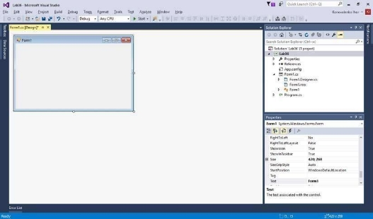

Лабораторна робота №8  

**Розробка простого застосунку Windows Forms.**  

Мета.  Вивчення  принципів  розробки  застосунків  з  графічним  інтерфейсом користувача на основі технології Windows Forms.   

**Теоретичні відомості**  
**
` `Для  створення  віконних  застосунків в  середовищі  .Net  можна  застосовувати технології  Windows Forms(WF) або Windows Presentation Foundashion (WPF), які використовують  подійно-орієнтований  підхід  для  створення  взаємодії користувача з додатком з використанням елементів управління. Використання основних  принципів  цих  технологій  розглянемо  на  прикладі  створення WFзастосунків.  

**Приклад.**  Створити  одновіконний  застосунок  на  основі  технології Windows Forms для розрахунку арифметичного виразу на основі функції з двома змінними  *f(x1,x2)*.  Програма  повинна  забезпечувати  ввід  значень  *x1*  та  *x2*, розрахунок значення функції *f(x1,x2)=X1·X2*, вивід результату розрахунку у вікно та очищення полів для наступного розрахунку.  Виконання завдання   

В середовищі Microsoft Visual Studio створити новий проект застосунку Windows Forms. Для цього вибрати команду меню File/New/Project. У вікні New Project вибрати  шаблон  Windows  Forms  Application  у  розділі  Templates/  Visual  C#/ Windows. Далі вказати назву проекту (наприклад, Lab07) та його розташування на диску. Буде створено проект з однією порожньою формою (рис. 8.1).   

*Рис. 8.1. Новий проект з порожньою формою**   

Розробка вікна застосунку   

Вікно застосунку проектують відповідно до його цілей. Для виконання нашого завдання вікно повинно мати поля для вводу значень x1 та x2 та поле для виводу результату  розрахунку  функції  f(x1,x2).  Крім  цього,  інтерфейс  має  містити засоби для  ініціювання  потрібних дій  (розрахунок, очищення  форми, вихід). Загальний вигляд вікна застосунку, розробка якого описана далі, показано на рис. 8.2.    

*Рис. 8.2. Вікно застосунку*  

1. Змінити назву файлу, який описує форму (Form1.cs), та назву самої форми, на fMain [^1] . Для цього у вікні Solution Explorer викликати контекстне меню на елементі  Form1.cs  та  вибрати  команду  Rename.  Перейменувати  файл  у fMain.cs. При цьому середовище перепитає, чи змінити у проекті також і змінну Form1, яка представляє форму. Вибрати "Так". Якщо вибрати "Ні", то назву форми слід змінити вручну. Для цього в дизайнері форм клікнути один раз на формі, далі у вікні Properties знайти властивість Name та задати для неї значення fMain.   
1. Задати для форми такі властивості:   
- Text = "Лабораторна робота №8" (текстові значення вводять без лапок)   
- Name = fMain   
- StartPosition = CenterScreen   
- Icon->MaximizeBox = false   

Щоб задати властивість будь-якого компонента, слід спочатку вибрати його у дизайнері форм, клікнувши на ньому один раз. Далі у вікні Properties слід знайти потрібну властивість (за її назвою) і ввести для неї значення.  Вікно  Properties   завжди   відображує  перелік  властивостей  для  вибраного  в дизайнері форм компонента. Щоб вибрати форму, слід клікнути на ній у тому місці, де немає інших компонентів.  

3. Перейти  до  вікна  Toolbox,  що  розташоване  зліва  у  середовищі  Microsoft  Visual  Studio  (рис. 7.3). Це вікно містить    перелік   

   `  `компонентів,    які    можна  використовувати    при  проектуванні   

   `  `застосунку.   Зокрема,   тут   є  

   `  `багато компонентів,   які  

   `  `представляють   різні елементи керування  для вікон програми (кнопки,    списки,   

   `  `меню    тощо).    Кожен    з   

   `  `цих   компонентів описаний  окремим  

   `  `класом   (ці   класи  поставляються  разом з Microsoft Visual Studio). Відповідно,  кожен клас має властивий   

   йому  набір  властивостей,  методів  та  подій                з їх описом можна ознайомитися у довідці  

   MSDN).              

*Рис. 8.3. Вікно Toolbox*  

4. Розмістити  на  формі  (у  дизайнері  форм)  три  компоненти  Label  (вони представляють текстові написи – "Змінна X1" та інші). Для цього знайти у вікні Toolbox цей компонент, клікнути на його кнопці, а потім клікнути у потрібному  місці  форми.  На  формі  з'явиться  вибраний  компонент.  В подальшому його можна перетягувати мишкою.   
4. Для кожного елемента Label слід задати властивість Text, відповідно:   
- "Змінна X1"   
- "Змінна X2"   
- "Результат розрахунку Y"   

Для цього спочатку слід вибрати перший компонент, задати його властивість (у вікні Properties), потім вибрати другий і т.д.   

3 

6. Напроти трьох міток Label розмістити на формі три компоненти Textbox (вони представляють білі прямокутні поля для текстового вводу). Ці компоненти призначені відповідно для введення значень *x1* та *x2* та виведення значення функції. Попередньо розміщені компоненти Label пояснюють призначення цих полів.   
6. Для  кожного  елемента  Textbox  слід  задати  властивість  Name  (назву), відповідно:   
- tbX1 [^2]   
- tbX2   
- tbY   

8. Для останнього елемента Textbox слід задати властивість ReadOnly = true (тільки  для  читання),  оскільки  його  значення  користувач  не  повинен змінювати безпосередньо.   
8. У нижній частині форми розмістити три компоненти Button. Їх призначення – ініціювання таких дій програми: розрахунок, очищення полів та вихід.   
8. Для  кожної  кнопки  слід  задати  властивості  Name  (назва)  і  Text  (напис), відповідно:   
- для першої: btnCalculate [^3] та "Обчислити"   
- для другої: btnClear та "Очистити"   
- для третьої: btnExit та "Вихід"   
11. У  дизайнері  форм  задати  розмір  вікна  таким,  щоб  воно  охоплювало  всі розміщені  елементи  керування  та не  містило  зайвого  порожнього  місця з країв. Для цього слід перетягнути правий чи нижній край вікна, або правий нижній кут вікна. Щоб забрати відступ зліва або зверху, потрібно виділити всі компоненти (Ctrl+A у дизайнері форм) та перетягти їх вліво чи вверх.   
11. Виконати  пробний  запуск  застосунку,  натиснувши клавішу F5. Після запуску  відобразиться спроектоване вікно (рис.  7.4).   У   поля  вікна,  

    `  `представлені  елементом  керування  Textbox, можна вводити якийсь текст.  На кнопки можна натискати,   але  

    `  `при   цьому   не  виконуються  ніякі  дії  (бо  нічого  ще  не  запрограмовано).  Вікно  слід  закрити, 

    натиснувши на кнопку з хрестиком у правому верхньому кутку).    

На цьому розробка вікна завершена. *Рис. 8.4. Спроектоване вікно*   Програмування дії обчислення виразу   

Для   ініціювання   обчислення   виразу   призначена   кнопка 

"Обчислити" (btnCalculation). Щоб запрограмувати дії, які виконуватиме програма при натисканні на кнопку, слід створити метод – оброблювач події Click:   

1. У дизайнері форм виділити кнопку "Обчислити".    
2. У  вікні  Properties  натиснути  на  кнопку  Events  і  перейти  на  сторінку відображення подій.   
2. Знайти подію Click і два рази клікнути у полі справа від неї. У середовищі Microsoft  Visual  Studio  відкриється  вікно  редактора  коду  з  автоматично створеним методом – оброблювачем цієї події:   

private void btnCalculation\_Click(object sender, EventArgs e)  {   }  

Щойно створений метод – оброблювач події не містить жодної інструкції. Код, написаний у цьому методі, автоматично виконуватиметсья при кожному натисканні на кнопку "Обчислити" (тобто, при кожному настанні події Click).   

4. Записати у метод btnCalculation\_Click код з лістингу 8.1.   

|Лістинг 8.1 |
| - |
|
if (string.IsNullOrEmpty(tbX1.Text) ||   

`   `(String.IsNullOrEmpty(tbX2.Text)))  

{      tbY.Text = "Не введено даних!";     return; }   double x1 = double.Parse(tbX1.Text); double x2 = double.Parse(tbX2.Text);  

double y = x1 \* x2;  

tbY.Text = y.ToString("0.######");
|

Програмування дії очищення полів   

Якщо  у  середовищі  Microsoft  Visual  Studio  відкрито  редактор  коду,  то  для переходу в дизайнер форм слід вибрати команду View Designer контекстного меню (чи натиснути клавіші Shift+F7), або скористатися відповідною вкладкою середовища. І навпаки: якщо відкрито дизайнер форм, то для переходу в редактор коду слід вибрати команду View Code контекстного меню (чи натиснути клавішу F7), або скористатися відповідною вкладкою середовища.   

1. У дизайнері форм виділити кнопку "Очистити".    
1. У  вікні  Properties  натиснути  на  кнопку  Events  і  перейти  на  сторінку відображення подій.   
1. Знайти подію Click і два рази клікнути у полі справа від неї. У середовищі Microsoft  Visual  Studio  відкриється  вікно  редактора  коду  з  автоматично створеним методом – оброблювачем цієї події:   

private void btnClear\_Click(object sender, EventArgs e)  {  

}  

4. Записати у метод btnClear\_Click код з лістингу 8.2.   

|Лістинг 8.2 |
| - |
|tbX1.Text = string.Empty; tbX2.Text = string.Empty; tbY.Text = string.Empty;  |

` `Програмування дії завершення роботи застосунку   

1. У дизайнері форм виділити кнопку "Вихід".    
1. У  вікні  Properties  натиснути  на  кнопку  Events  і  перейти  на  сторінку відображення подій.   
1. Знайти подію Click і два рази клікнути у полі справа від неї. У середовищі Microsoft  Visual  Studio  відкриється  вікно  редактора  коду  з  автоматично створеним методом – оброблювачем цієї події:   

private void btnExit\_Click(object sender, EventArgs e)  {  

}  

4. Записати у метод btnExit\_Click код з лістингу 8.3.   

|Лістинг 8.3 |
| - |
|Application.Exit();  |

Запуск і тестування роботи застосунку   

Щоб  запустити  застосунок,  у  середовищі  Microsoft  Visual  Studio  потрібно натиснути  клавішу  F5.  Далі  слід  ввести  значення  для  змінних  X1,  X2,  і перевірити функціонал всіх кнопок: для розрахунку, очищення форми та виходу з програми.   

**Завдання для самостійного опрацювання**  

1. Вирішити  розглянуте  раніше  завдання  для  заданої  функції  *f(x1,  x2)*  згідно варіанту (таблиця 8.1).  
1. Додатково до попереднього завдання, обчислити та вивести на екран:   
- для варіантів, номери яких закінчуються на 0…3 – середнє арифметичне значень *x1,*  *x2*;   
- для варіантів, номери яких закінчуються на 4…6 – менше із значень *x1, x2*;   
- для варіантів, номери яких закінчуються на 7…9 – більше із значень *x1, x2*;   
3. При виводі числових значень на екран:   
- для варіантів, номери яких закінчуються на 0…3 – виводити 4 знаки після  коми;   •  для  варіантів,  номери  яких  закінчуються  на  4…6  – виводити 3 знаки після коми;   
- для інших варіантів – виводити значення в експоненційному форматі.   

Для вирішення завдання було створено форму аналогічну до тієї, яка була в ході роботи. Функція була змінена на **варіант 10** із таблиці. Також було додано  поле  для  підрахунку  середнього  арифметичного  і  вивід  чотирьох знаків після коми. Код програми: 

using System; 

using System.Collections.Generic; using System.ComponentModel; using System.Data; 

using System.Drawing; 

using System.Linq; 

using System.Text; 

using System.Threading.Tasks; using System.Windows.Forms; 

namespace Lab8 

{ 

`    `public partial class Form1 : Form     { 

`        `public Form1() 

`        `{ 

`            `InitializeComponent(); 

`        `} 

private void button1\_Click(object sender, EventArgs e) { 

} 

`        `private void button\_exit\_Click(object sender, EventArgs e)         { 

`            `this.Close(); 

`        `} 

`        `private void button\_calc\_Click(object sender, EventArgs e)         { 

`            `double x1 = double.Parse(x1\_textbox.Text); 

`            `Console.WriteLine(x1); 

`            `double x2 = double.Parse(x2\_textbox.Text); 

`            `Console.WriteLine(x2); 

`            `avarage\_textbox.Text = ((x1 + x2) / 2).ToString(); 

`            `double result = Math.Cos(x1 \* (x2 / (x1 + 53 \* Math.Pow(x2, 2)))); 

`            `string formattedString = String.Format("{0:0.0000}", result);             result\_textbox.Text = formattedString; 

} 

`        `private void button\_clear\_Click(object sender, EventArgs e)         { 

`            `x1\_textbox.Text = string.Empty; 

`            `x2\_textbox.Text = string.Empty; 

`            `result\_textbox.Text = string.Empty; 

`        `} 

`    `} 

}

Результат роботи програми зображено на рисунку 8.1. 

Рисунок 8.1 – Розрахунок по заданій формулі 
9 

[^1]: В загальному випадку назви змінним, які представляють об'єкти, можна давати довільно. Але прийнято, щоб назва містила інформацію про тип об'єкта та його призначення. У назві fMain префікс f означає тип об'єкта (це екземпляр класу Form), а Main означає, що це головна форма програми.   

    2 
[^2]: У назві tbX1 префікс tb означає тип компонента – Textbox, а X1 – призначення: ввід значення X1. Назви інших полів сформовано за цим же принципом.   
[^3]: У назві btnCalc префікс btn означає тип Button, а Calculate – призначення кнопки (calculate – обчислювати). Назви інших кнопок сформовано аналогічно.   