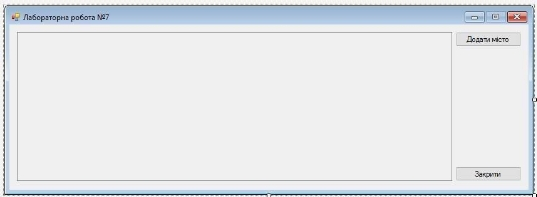
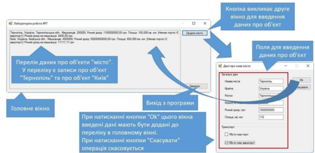
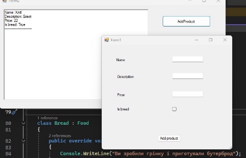
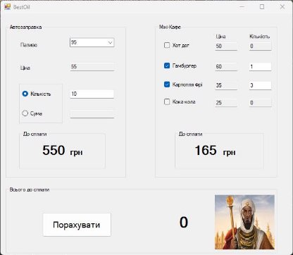
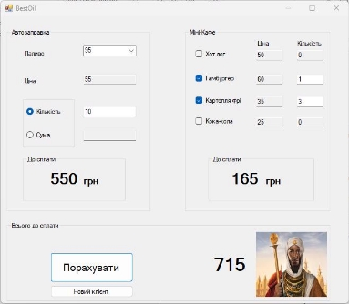

**Розробка багатовіконного застосунку Windows Forms**  

Мета.  Ознайомлення  принципами  розробки  багатовіконних  застосунків  на основі технології Windows Forms.   

**Завдання**   

Розробити застосунок Windows Forms, який у головному вікні міститиме перелік даних  про  об'єкти типу  "місто». Крім  цього, головне  вікно повинне  містити елемент  керування,  при  активації  якого  має  відображуватися  друге  вікно, призначене для внесення повної інформації про об'єкт "місто". Друге вікно має забезпечувати  користувачеві  вибір:  а)  підтвердити  введені  дані  (тоді  їх  слід додати  до  переліку  в  головному  вікні);  б)  скасувати  операцію.  Перелік  у головному  вікні,  крім  значень  полів  об'єкта,  має  відображувати  і  результат виклику одного з його методів.   

**Виконання завдання**   

В середовищі Microsoft Visual Studio створити новий проект застосунку Windows Forms. Для цього вибрати команду меню File/New/Project. У вікні New Project вибрати  шаблон  Windows  Forms  Application  у  розділі  Templates/  Visual  C#/ Windows. Далі вказати назву проекту (наприклад, Lab08) та його розташування на диску.    

**Розробка головного вікна застосунку**   

1. Змінити назву файла, який описує головне вікно, на fMain.   
1. Автоматично створена форма представлятиме головне вікно програми. Для головного вікна задати властивості:    
- Name = fMain   
- Icon->MaximizeBox = false   
- StartPosition = CenterScreen   
- Text = "Лабораторна робота №8"   
3. Розмістити на формі компонент Textbox (рис. 8.1). Він буде призначений для виведення текстової інформації про об'єкти. Задати для нього властивості:   
- Name = tbTownsInfo   
- Multiline = true   
- ReadOnly = true   
4. Задати  розмір  компонента  достатньо  великим  для  відображення  значного масиву тексту.   
5. Розмістити у правій частині форми дві кнопки. Одна з них призначена для введення даних про новий об'єкт "місто", а друга – для закінчення роботи застосунку.   

*Рис. 9.1. Головна форма застосунку*   

6. Налаштувати властивості кнопки "Додати місто":   
   1. Name = btnAddTown   
   1. Text = "Додати місто"   
7. Налаштувати властивості кнопки "Закрити"   
   1. Name = btnClose   
   1. Text = "Закрити"   

*Створення класу, який описує об'єкт "місто"*   

Клас прийнято описувати в окремому файлі. Щоб створити файл з описом класу:   

1. У контекстному меню для елемента, який відповідає проекту (у вікні Solution Explorer),  вибрати  команду  Add\New  Item…  Далі  у  вікні,  яке  з'явиться,  в переліку Visual C# Items вибрати пункт Class, ввести назву класу – Town, і натиснути кнопку Add.   
1. У файлі Town.cs (він відкриється у редакторі коду) ввести опис класу (його можна  скопіювати  з  попередньої  лабораторної).  Код  класу  приведено  у лістингу 9.1.   

Лістинг 9.1   

public class Town   

{  

`    `public string Name;     public string Country;     public string Region;     public int Population;     public double YearIncome;     public double Square;     public bool HasPort;     public bool HasAirport;  

`    `public double GetYearIncomePerInhabitant()      {  

`        `return YearIncome / Population;     }  

}

Розробка вікна для вводу даних про об'єкт "місто"   

1. Додати до проекту нову форму. Для цього у контекстному меню елемента, який відповідає проекту (у вікні Solution Explorer), вибрати команду Add\New Item… Далі у вікні, яке з'явиться, в переліку Visual C# Items вибрати пункт Windows  Form,  ввести  назву  класу,  який  описуватиме  форму  –  fTown,  і натиснути кнопку Add.   
1. Задати   для   форми   fTown  властивості:     
- Icon->MaximizeBox = false    
- StartPosition = CenterScreen •   Text = "Дані про нове місто"    
- ShowInTaskBar = false.    
3. Розмістити  на  формі  компонент  GroupBox,   призначений   для  візуального  групування  елементів  керування. Задати властивість Text =  

   "Загальні дані".    *Рис. 9.2. Вікно для введення даних про місто* 

4. За замовчуванням він матиме назву groupBox1.   
4. Збільшити розмір компонента groupBox1 і розмістити на ньому 6 компонентів  Label.   
4. Задати  властивість  Text кожного компонента відповідно до рис. 9.2.   
7. Розмістити на компоненті groupBox1 напроти кожного компонента Label 6 елементів керування TextBox (див. рис. 9.2). Задати їм такі назви (властивості Name):   
- tbName (напроти напису "Назва міста");   
- tbCountry ("Країна");   
- tbRegion ("Регіон");   
- tbPopulation ("Кількість мешканців");   
- tbYearIncome ("Річний дохід, грн");   
- tbSquare ("Площа, кв.км");   
8. Розмістити на формі другий компонент GroupBox під першим (див. рис. 9.2). Задати його властивість Text = "Транспорт". За замовчуванням він матиме назву groupBox2.   
8. Збільшити розмір компонента groupBox2 і розмістити на ньому 2 компоненти CheckBox.  Задати  властивість  Text  кожного  компонента  відповідно  до малюнка.   
8. Задати компонентам CheckBox такі назви (властивість Name):   
- chbHasPort (компонент з написом "Місто має порт");  • chbHasAirport (компонент з написом "Місто має аеропорт")   
11. Розмістити на формі 2 компоненти Button (див. рис. 9.2).    
11. Для першої кнопки задати властивості:   
- Name = btnOk   
- Text = "Ok"   
13. Для другої кнопки задати властивості:   
- Name = btnCancel   
- Text = "Скасувати"   
14. Після  розміщення  кнопок  вибрати  компонент  форми  і  задати  для  нього властивості:   
- AcceptButton  =  btnOk  (автоматичне  спрацювання  кнопки  при натисканні Enter)   
- CancelButton  =  btnCancel  (автоматичне  спрацювання  кнопки  при натисканні Esc)   
15. Задати розмір вікна так, щоб його площа відповідала площі використаних елементів керування.   

*Код модуля fTown.cs*   

1. Перейти до редагування коду модуля fTown.cs. З дизайнера форм це можна зробити за допомогою клавіші F7.   
1. У  клас fTown додати  одне публічне  поле  (це поле представлятиме об'єкт "місто", у якому міститимуться введені у вікні дані):   

public Town TheTown;  

3. Змінити конструктор fTown, надавши йому виду:   

public fTown(Town t)  {  

`    `TheTown = t;  

`    `InitializeComponent();  }  

У  конструктор  передається  параметр  t  класу  Town.  У  цей  об'єкт  (після натискання кнопки "Ok") буде записано дані, введені користувачем у формі. Поле TheTown зберігає посилання на об'єкт.   

4. Створити  оброблювач  події  Click  для  кнопки  btnOk  (для  цього  два  рази клацнути на ній у дизайнері форм).   
4. У оброблювач записати код з лістингу 9.2 (сірим у лістингу виділено код, автоматично  згенерований  середовищем,  том  вручну  його  вносити  не потрібно).   

|Лістинг 9.2 |
| - |
|
private void btnOk\_Click(object sender, EventArgs e)  

{  

`    `TheTown.Name = tbName.Text.Trim();  

`    `TheTown.Country = tbCountry.Text.Trim();  

`    `TheTown.Region = tbRegion.Text.Trim();  

`    `TheTown.Population = int.Parse(tbPopulation.Text.Trim());  

`    `TheTown.YearIncome = double.Parse(tbYearIncome.Text.Trim());      TheTown.Square = double.Parse(tbSquare.Text.Trim());  

`    `TheTown.HasPort = chbHasPort.Checked;  

`    `TheTown.HasAirport = chbHasAirport.Checked;  
|

`    `DialogResult = DialogResult.OK; } 

Тут значення з полів форми записуються у об'єкт TheTown, посилання на який передається у конструкторі fTown при створенні форми.   

Поле DialogResult форми містить її модальний результат. Модальний результат діалогового вікна DialogResult.OK у нашому випадку означає, що дані успішно введено і записано в об'єкт TheTown   

6. Створити оброблювач події Click для кнопки btnCancel (для цього два рази клацнути на ній у дизайнері форм).   
6. У оброблювач записати код з лістингу 9.3.   

|Лістинг 9.3 |
| - |
|private void btnCancel\_Click(object sender, EventArgs e) {      DialogResult = DialogResult.Cancel; }|

Поле DialogResult форми містить її модальний результат. Модальний результат діалогового вікна DialogResult.Cancel у нашому випадку означає, що користувач скасовує операцію і введені дані не потрібні (не записуємо їх у об'єкт TheTown).   

8. Створити оброблювач події Load для форми (для цього два рази клацнути на ній у дизайнері форм).   
8. У оброблювач записати код, який при першому показі вікна відображує дані об'єкта, передані при створенні вікна (лістинг 8.4).   

|Лістинг 9.4 |
| - |
|
private void fTown\_Load(object sender, EventArgs e)  

{      if (TheTown != 

null)  

`    `{  

`        `tbName.Text = TheTown.Name;         tbCountry.Text = TheTown.Country;         tbRegion.Text = TheTown.Region;          tbPopulation.Text = 

TheTown.Population.ToString();         tbYearIncome.Text = TheTown.YearIncome.ToString("0.00");         tbSquare.Text = TheTown.Square.ToString("0.000");          chbHasPort.Checked  =  TheTown.HasPort;

chbHasAirport.Checked = TheTown.HasAirport;     }  
|

}

Програмування операцій головного вікна   

1. Перейти до дизайнера форм з головним вікном (можна через Solution  Explorer).   
1. Створити оброблювач події Click для кнопки btnAddTown ("Додати місто"). Це можна зробити, два рази клацнувши на кнопці у дизайнері, або через вікно Properties.   
1. Привести оброблювач до виду згідно лістингу 9.5.   

|Лістинг 9.5 |
| - |
|
private void btnAddTown\_Click(object sender, EventArgs e) {      Town town = new Town();  

`    `fTown ft = new fTown(town);  

`    `if (ft.ShowDialog() == DialogResult.OK)  

`    `{  

`        `tbTownsInfo.Text +=              string.Format("{0}, {1}, {2}. Мешканців: {3}. Річний дохід: {4:0.00} грн. Площа: {5:0.000} кв. км. [{6} | {7}] | Річний дохід на мешканця: {8:0.00} грн\r\n",  
|

`            `town.Name, town.Country, town.Region,             town.Population, town.YearIncome, town.Square,             town.HasPort ? "Є порт" : "Немає порта",              town.HasAirport ? "Є аеропорт" : "Немає аеропорта",             town.GetYearIncomePerInhabitant());  

`    `} }  

Тут спочатку створюємо екземпляр класу Town, потім показуємо його, і, якщо у вікні fTown натиснено кнопку "Ok", формуємо рядок на основі введених даних про об'єкт "місто" та додаємо його у перелік міст tbTownsInfo.   

4. Перейти до дизайнера форм з головним вікном (можна через Solution  Explorer).   
5. Створити оброблювач події Click для кнопки btnClose ("Закрити"). Це можна зробити, два рази клацнувши на кнопці у дизайнері, або через вікно Properties.   
5. Привести оброблювач до виду  згідно лістингу 9.6.   

|Лістинг 9.6 |
| - |
|
private void btnClose\_Click(object sender, EventArgs e)  

{  

`  `if (MessageBox.Show("Припинити роботу застосунку?",        "Припинити роботу", MessageBoxButtons.OKCancel,        MessageBoxIcon.Question) == DialogResult.OK)      Application.Exit(); } 
|

У  цьому  коді  користувачеві  задаємо  запитання  ("Припинити  роботу застосунку?"). Користувач має два варіанти відповіді, представлені кнопками OK та Cancel (параметр MessageBoxButtons.OKCancel). Вказано також тип  

діалогового вікна   

(MessageBoxIcon.Question)  –  вікно  з  запитанням.  Якщо  при  перепитуванні користувач натиснув кнопку Ok, закриваємо застосунок.   

` `*Запуск і тестування роботи застосунку*   

Щоб запустити застосунок, потрібно натиснути клавішу F5. Слід перевірити весь функціонал програми (див. схему на рис. 9.3). Приклад головного вікна програми з введеними даними про міста приведено на рис. 9.4.   

*Рис. 9.3. Ілюстрація роботи застосунку*   

*Рис. 9.4. Приклад головного вікна застосунку з введеними даними**   

**Завдання для самостійного опрацювання**  

1. Вирішити розглянуте раніше завдання щодо предметної області, вказаної у завданні  до  лабораторної  роботи.  Для  опису  об'єкта  використати  один  з класів, розроблених при виконанні лабораторної роботи №4.  

Було створено двохвіконний додаток аналогічно до того, що було показано у теоретичних  відомостях.  Предметна  область  –  продукти,  хліб(обирається  за допомогою чекбоксу на другій формі). 

Код основної форми: 

using System; 

using System.Collections.Generic; using System.ComponentModel; using System.Data; 

using System.Drawing; 

using System.Linq; 

using System.Text; 

using System.Threading.Tasks; using System.Windows.Forms; 

namespace Lab\_9 

{ 

`    `public partial class Form2 : Form     { 

`        `public Form2() 

`        `{ 

`            `InitializeComponent(); 

`        `} 

`        `private void button1\_Click(object sender, EventArgs e)         { 

`            `Product some\_food = new Food(); 

`            `Product some\_bread = new Bread(); 

`            `Form1 forma = new Form1(some\_food, some\_bread); 

String result\_text; 

if (forma.ShowDialog() == DialogResult.OK) { 

`                `if (some\_food.Name != null) 

`                `{ 

`                    `result\_text = $"Name: {some\_food.Name}\r\nDescription: {some\_food.Description}\r\n" + 

`                        `$"Price: {some\_food.Price}\r\n------------------- ----------\r\n"; 

`                `} 

`                `else 

`                `{ 

`                    `result\_text = $"Name: {some\_bread.Name}\r\nDescription: {some\_bread.Description}\r\n" + 

`                        `$"Price: {some\_bread.Price}\r\nIs bread: True\r\n-----------------------------\r\n"; 

`                `} 

`                `richTextBox1.Text += result\_text; 

`                `result\_text = ""; 

`            `}         } 

`        `private void button2\_Click(object sender, EventArgs e)         { 

`            `this.Close(); 

`        `} 

`    `} 

}

Код для другої форми, де вводяться параметри: 

using System; 

using System.Collections.Generic; using System.ComponentModel; using System.Data; 

using System.Drawing; 

using System.Linq; 

using System.Text; 

using System.Threading.Tasks; using System.Windows.Forms; 

namespace Lab\_9 { 

`    `public partial class Form1 : Form 

`    `{ 

`        `private Product some\_food; 

`        `private Product bread; 

`        `public Form1(Product food, Product bread\_input)         { 

`            `some\_food = food; 

`            `bread = bread\_input; 

`            `InitializeComponent(); 

20 

`        `private void button1\_Click(object sender, EventArgs e)         { 

`            `if (!checkBox1.Checked) 

`            `{ 

`                `some\_food.Name = textBox1.Text; 

`                `some\_food.Description = textBox2.Text; 

`                `some\_food.Price = double.Parse(textBox3.Text);             } 

`            `else 

`            `{ 

`                `bread.Name = textBox1.Text; 

`                `bread.Description = textBox2.Text; 

`                `bread.Price = double.Parse(textBox3.Text); 

`            `} 

`            `DialogResult = DialogResult.OK; 

`        `} 

`    `} 

`    `public abstract class Product 

`    `{ 

`        `public abstract string Name { get; set; } 

`        `public abstract string Description { get; set; }         public abstract double Price { get; set; } 

public abstract void Use(); public abstract void Prepare(); 

} 

`    `public class Food : Product 

`    `{ 

`        `public override string Name { get; set; } 

`        `public override string Description { get; set; }         public override double Price { get; set; } 

`        `public override void Use() 

`        `{ 

`            `Console.WriteLine($"Ви з'їли {Name}");         } 

`        `public override void Prepare() 

`        `{ 

`            `Console.WriteLine($"Ви приготували {Name}"); 

} 

`        `public virtual void MoveToTrashBin() 

`        `{ 

`            `Console.WriteLine($"Ви викинули {Name} у смітник");         } 

} 

class Bread : Food { 

`        `public override void Prepare() 

`        `{ 

`            `Console.WriteLine("Ви зробили грінку і приготували бутерброд"); 

`        `} 

`        `public override void MoveToTrashBin() 

`        `{ 

`            `Console.WriteLine("Ви не можете викинути хліб. Хліб - усьому голова"); 

`        `} 

`    `} } 

**Зовнішій вигляд** додатку із результатом роботи зображено на рисунку 9.1. 

\        Рисунок 9.1 – Додаток із двома формами, що взаємодіють між собою 

2. Постановка задачі: Власник автозаправки «BestOil» замовив таку програму: Коли автозаправка тільки розпочинає свою діяльність, власник зазвичай хоче отримувати максимально великий дохід, який планує збільшити за рахунок додаткових  послуг.  Тому  на  автозаправці  діятиме  невелике  кафе.  Але, водночас, він може найняти лише одного працівника на посаду касира, а тому призначення програми – облік продажу бензину та асортименту товарів у мінікафі.  

**Вимоги  до  поставленого  завдання:**  Для  зручності  вікно  поділено  на  три частини:  перша  для  здійснення  обчислень,  що  стосуються  безпосередньо 

22 

заправки автомобілів паливом; друга – покупки у міні-кафе; третя – обчислення суми оплати.   

Отже, перша група елементів автозаправки: ComboBox – список з переліком наявного пального. За замовчуванням, відразу при запуску програми має бути обраний  певний  вид  пального  і  TextBox  (або  наприклад  Label)  повинен відображати ціну на даний вид продукту. При кожній зміні вибору типу бензину ціна  в  даному  полі  буде  змінюватися  відповідно.  Далі,  дається  можливість вибору: купити пальне, вказавши необхідну кількість літрів або вказавши, на яку суму клієнт заправлятиметься. При цьому після вибору одного з двох варіантів надання  послуги  непотрібне  поле  стає  заблокованим.  У  разі  введення  суми грошей група «До оплати» змінить назву на «До видачі»; замість суми слід виводити кількість літрів, відповідно, змінюються одиниці виміру з «грн..» на  

«л»..   

Друга група – Міні-кафе. Для зручності всі можливі товари виведені відразу в цій  частині.  Для  кожного  продукту  передбачено  CheckBox  з назвою  товару, поруч виводиться ціна (неактивний TextBox). При отриманні замовлення для можливості  введення  кількості  замовлених  одиниць  товару  слід  поставити «галочку» в CheckBox навпроти відповідного товару.   

Остання група – «До оплати». Містить кнопку, яка відповідає за здійснення обчислення та виведення сум у відповідних полях. Після того, як виведена сума, через (наприклад) 10 секунд повинен з'явитися запит на очищення форми, тобто при  появі  наступного  клієнта:  так  –  всі  поля  набувають  значення  за замовчуванням, ні – незмінний стан залишається ще на 10 секунд.  

` `При  виході  з  програми  (закінчився  робочий  день)  має  з'явитися  вікно  з повідомленням, якою є загальна сума виручки за цей день. Або цю суму можна відразу  виводити  у  самій  формі  та  змінювати  після  кожного  здійснення розрахунку з клієнтом. А також довідником.  

Крім цього, надайте формі естетичного вигляду (кольори, шрифти, малюнки...). При  обґрунтованій  необхідності  та  цікавому  вирішенні  функціональності програми  дозволяється  вносити  зміни  у  зовнішній  вигляд  форми  або  набір елементів.  

Орієнтовний вигляд форми для вирішення даного завдання наведено нижче.  Для  вивчення  правил  використання  додаткових  елементів  форми  можна скористатися  довідковою  літературою  MSDN  а  також  довідником [ Основні елементи WF  ](https://drive.google.com/file/d/1-uiHZR0knHcmlHPaxoOFam-MJMqxrEp7/view?usp=sharing)

Для реалізації цього завдання було створено форму із елементами ComboBox, RadioButton, PushButton, Checkbox, GroupBox, TextBox. Було оброблено багато подій, наприклад, щоб  readOnly  текстового  поля  був  True,  якщо  натиснутий відповідний  чекбокс.  Підрахунок  у  двох  частинах(автозаправка  і  міні  кафе) здійснюється  автоматично під час  введеня  даних  у  текстові поля. Сумарний підрахунок спрацьовує тільки на кнопку. Після натискання на кнопку підрахунку через десять секунд з’являється кнопка для очистки і обслуговування нового клієнта. Ще через 10 секунд форма автоматично перезапускається. Для цього було використано елемент timer, який має поді. Tick, що спрацьовує через задані у властивостях інтервали часу. 

Код додатку: 

using System; 

using System.Collections.Generic; using System.ComponentModel; using System.Data; 

using System.Drawing; 

using System.Linq; 

using System.Text; 

using System.Threading.Tasks; using System.Windows.Forms; 

namespace Lab9\_2 

{ 

`    `public partial class Form1 : Form 

`    `{ 

`        `private double fuel\_price = 0; 

`        `private double food\_price = 0; 

`        `private double hot\_dog\_price = 50; 

`        `private double fry\_potato\_price = 35;         private double humburger\_price = 60;         private double coca\_cola\_price = 25;         private double fuel\_price\_sum = 0; 

`        `private int time = 0; 

`        `public Form1() 

`        `{ 

`            `InitializeComponent(); 

`            `comboBox1.Text = "95"; 

`            `fuel\_price = 55; 

`            `textBox5.Text = fuel\_price.ToString();         } 

`        `private void checkBox1\_CheckedChanged(object sender, EventArgs e)         { 

`            `if (checkBox1.Checked) 

`            `{ 

`                `textBox1.ReadOnly = false; 

`            `} 

`            `else 

`            `{ 

`                `textBox1.ReadOnly = true; 

`            `} 

`            `CalcProduct(); 

`        `} 

`        `private void checkBox2\_CheckedChanged(object sender, EventArgs e)         { 

`            `if (checkBox2.Checked) 

`            `{ 

`                `textBox2.ReadOnly = false; 

`            `} 

`            `else 

`            `{ 

`                `textBox2.ReadOnly = true; 

`            `} 

`            `CalcProduct(); 

`        `} 

`        `private void checkBox3\_CheckedChanged(object sender, EventArgs e)         { 

`            `if (checkBox3.Checked) 

`            `{ 

`                `textBox3.ReadOnly = false; 

`            `} 

`            `else 

`            `{ 

`                `textBox3.ReadOnly = true; 

`            `} 

`            `CalcProduct(); 

`        `} 

`        `private void checkBox4\_CheckedChanged(object sender, EventArgs e)         { 

`            `if (checkBox4.Checked) 

`            `{ 

`                `textBox4.ReadOnly = false; 

`            `} 

`            `else 

`            `{ 

`                `textBox4.ReadOnly = true; 

`            `} 

`            `CalcProduct(); 

25 
} 

`        `private void comboBox1\_SelectionChangeCommitted(object sender, EventArgs e) 

`        `{ 

} 

`        `private void radioButton2\_CheckedChanged(object sender, EventArgs e) 

`        `{ 

`            `textBox6.ReadOnly = true; 

`            `textBox7.ReadOnly = false; 

} 

`        `private void radioButton1\_CheckedChanged(object sender, EventArgs e) 

`        `{ 

`            `textBox6.ReadOnly = false; 

`            `textBox7.ReadOnly = true; 

`            `textBox6.Text = "0"; 

`        `} 

`        `private void Form1\_Load(object sender, EventArgs e)         { 

`            `textBox11.Text = hot\_dog\_price.ToString(); 

`            `textBox10.Text = humburger\_price.ToString(); 

`            `textBox9.Text = fry\_potato\_price.ToString(); 

`            `textBox8.Text = coca\_cola\_price.ToString(); 

`        `} 

`        `private void CalcProduct() 

`        `{ 

`            `Double hot\_dog\_local\_price = 0; 

`            `Double local\_humburger\_price = 0; 

`            `Double local\_fry\_potato\_price = 0; 

`            `Double local\_coca\_cola\_price = 0; 

`            `if (checkBox1.Checked) 

`            `{ 

`                `if (textBox1.Text != string.Empty) 

`                `{ 

`                    `hot\_dog\_local\_price = hot\_dog\_price \* double.Parse(textBox1.Text); 

`                `} 

`            `} 

`            `if (checkBox2.Checked) 

`            `{ 

`                `if (textBox2.Text != string.Empty) 

`                `{ 

`                    `local\_humburger\_price = humburger\_price \* double.Parse(textBox2.Text); 

`                `} 

`            `} 

`            `if (checkBox3.Checked) 

`            `{ 

`                `if (textBox3.Text != string.Empty) 

26 

`                `{ 

`                    `local\_fry\_potato\_price = fry\_potato\_price \* double.Parse(textBox3.Text); 

`                `} 

`            `} 

`            `if (checkBox4.Checked) 

`            `{ 

`                `if (textBox4.Text != string.Empty) 

`                `{ 

`                    `local\_coca\_cola\_price = coca\_cola\_price \* double.Parse(textBox4.Text); 

`                `} 

`            `} 

`            `food\_price = hot\_dog\_local\_price + local\_humburger\_price + local\_coca\_cola\_price + local\_fry\_potato\_price; 

`            `label3.Text = food\_price.ToString(); 

`        `} 

`        `private void textBox6\_TextChanged(object sender, EventArgs e)         { 

`            `if(textBox6.Text != string.Empty) 

`            `{ 

`                `fuel\_price\_sum = Double.Parse(textBox6.Text) \* fuel\_price; 

`                `label4.Text = fuel\_price\_sum.ToString(); 

`            `} 

} 

`        `private void button1\_Click(object sender, EventArgs e) 

`        `{ 

`            `label5.Text = (food\_price + fuel\_price\_sum).ToString();             timer1.Enabled = true; 

`        `} 

`        `private void textBox1\_TextChanged(object sender, EventArgs e)         { 

`            `CalcProduct(); 

`        `} 

`        `private void textBox2\_TextChanged(object sender, EventArgs e)         { 

`            `CalcProduct(); 

`        `} 

`        `private void textBox3\_TextChanged(object sender, EventArgs e)         { 

`            `CalcProduct(); 

`        `} 

`        `private void textBox4\_TextChanged(object sender, EventArgs e)         { 

`            `CalcProduct(); 

`        `} 

private void textBox7\_TextChanged(object sender, EventArgs e) { 

27 

`            `if(textBox7.Text != String.Empty) 

`            `{ 

`                `Double fuel\_sum = Double.Parse(textBox7.Text); 

`                `label4.Text = fuel\_sum.ToString(); 

`                `textBox6.Text = (fuel\_sum / fuel\_price).ToString();             } 

`            `else 

`            `{ 

`                `label4.Text = "0"; 

`            `} 

`        `} 

`        `private void timer1\_Tick(object sender, EventArgs e)         { 

`            `time += 1; 

`            `if (time > 9) 

`            `{ 

`                `button2.Visible = true; 

`                `if (time > 19) 

`                `{ 

`                    `Console.WriteLine("Працуе"); 

`                    `button2.Visible = false; 

`                    `time = 0; 

`                    `timer1.Enabled = false; 

`                    `Application.Restart(); 

`                `} 

`            `} 

`        `} 

`        `private void button2\_Click(object sender, EventArgs e)         { 

`            `Application.Restart(); 

`        `} 

`        `private void comboBox1\_SelectedIndexChanged(object sender, EventArgs e) 

`        `{ 

`            `if (comboBox1.Text == "98") 

`            `{ 

`                `fuel\_price = 60; 

`            `} 

`            `else if (comboBox1.Text == "95") 

`            `{ 

`                `fuel\_price = 55; 

`            `} 

`            `else if (comboBox1.Text == "ДП") 

`            `{ 

`                `fuel\_price = 54.40; 

`            `} 

`            `else if (comboBox1.Text == "Газ") 

`            `{ 

`                `fuel\_price = 28; 

`            `} 

`            `else if (comboBox1.Text == "95+") 

`            `{ 

`                `fuel\_price = 56; 

`            `} 

`            `textBox5.Text = fuel\_price.ToString(); 

`        `} 

} } 

Інтерфейс форми зображено на рисунках 9.2 і 9.3. 

Рисунок 9.2 – Інтерфейс розробленої програми 

Рисунок 9.3 – Активація кнопки “Новий клієнт” через 10 секунд після 

підрахунку 
29 
